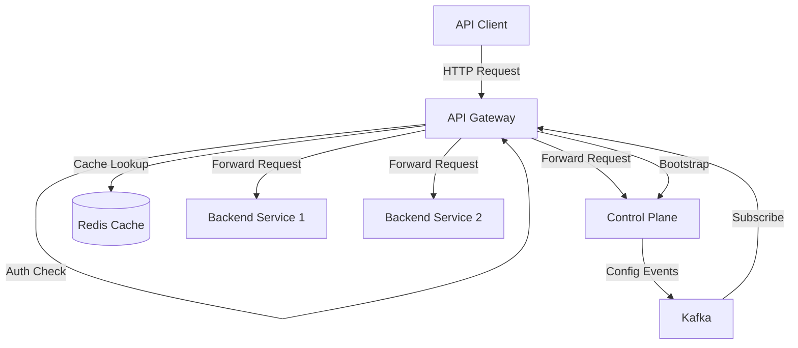
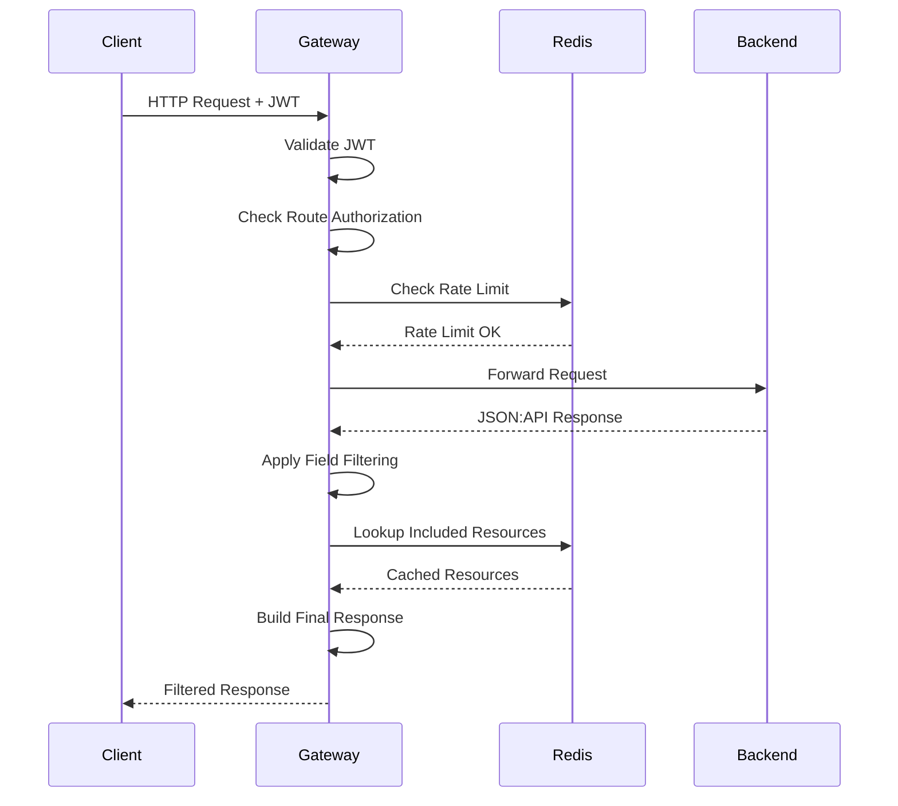

# Design Document: API Gateway Integration

## Overview

The EMF API Gateway is a Spring Cloud Gateway-based service that serves as the main ingress point for all EMF platform applications. It provides centralized authentication, authorization, dynamic routing, JSON:API processing with intelligent caching, and rate limiting capabilities. The gateway integrates with the EMF control plane through REST APIs and Kafka event streams to maintain up-to-date routing and security configurations.

The gateway follows a reactive, non-blocking architecture using Spring WebFlux and Project Reactor to handle high throughput with low latency. Configuration updates are applied dynamically without requiring service restarts, enabling zero-downtime configuration changes.

## Architecture

### High-Level Architecture



### Request Processing Flow



### Component Architecture

The gateway consists of several key components:

1. **Route Manager**: Maintains dynamic route registry and handles configuration updates
2. **Authentication Filter**: Validates JWT tokens and extracts principal information
3. **Authorization Filter**: Enforces route and field-level authorization policies
4. **JSON:API Processor**: Processes include parameters and builds compound documents
5. **Rate Limiter**: Enforces rate limits using Redis-backed counters
6. **Config Listener**: Subscribes to Kafka topics for configuration updates
7. **Health Monitor**: Tracks connectivity to dependencies

## Components and Interfaces

### 1. Route Manager

**Purpose**: Manages the dynamic route registry and handles route configuration updates.

**Key Classes**:
- `DynamicRouteLocator`: Implements `RouteLocator` to provide routes to Spring Cloud Gateway
- `RouteRegistry`: In-memory store for route definitions indexed by path pattern
- `RouteConfigService`: Fetches initial configuration from control plane

**Interfaces**:

```java
public interface RouteRegistry {
    void addRoute(RouteDefinition route);
    void removeRoute(String routeId);
    void updateRoute(RouteDefinition route);
    Optional<RouteDefinition> findByPath(String path);
    List<RouteDefinition> getAllRoutes();
    void clear();
}

public interface RouteConfigService {
    BootstrapConfig fetchBootstrapConfig();
    void refreshRoutes();
}
```

**Route Definition Structure**:
```java
public class RouteDefinition {
    private String id;              // Unique route ID (collection ID)
    private String serviceId;       // Backend service ID
    private String path;            // Path pattern (e.g., "/api/users/**")
    private String backendUrl;      // Backend service URL
    private String collectionName;  // Collection name for authz lookup
    private RateLimitConfig rateLimit;  // Optional rate limit config
}
```

### 2. Authentication Filter

**Purpose**: Validates JWT tokens and extracts authenticated principal information.

**Key Classes**:
- `JwtAuthenticationFilter`: Global filter that runs before routing
- `JwtValidator`: Validates JWT signatures and expiration
- `PrincipalExtractor`: Extracts user information from JWT claims

**Interfaces**:

```java
public interface JwtValidator {
    Mono<Jwt> validate(String token);
    boolean isExpired(Jwt jwt);
}

public interface PrincipalExtractor {
    GatewayPrincipal extractPrincipal(Jwt jwt);
}

public class GatewayPrincipal {
    private String username;
    private List<String> roles;
    private Map<String, Object> claims;
}
```

**Filter Implementation**:
- Order: -100 (runs early in filter chain)
- Extracts Authorization header
- Validates JWT using Spring Security OAuth2 Resource Server
- Stores principal in ServerWebExchange attributes
- Returns 401 for missing/invalid tokens
- Allows unauthenticated access to bootstrap endpoint

### 3. Authorization Filter

**Purpose**: Enforces route-level and field-level authorization policies.

**Key Classes**:
- `RouteAuthorizationFilter`: Checks route policies before forwarding
- `FieldAuthorizationFilter`: Filters response fields after backend response
- `PolicyEvaluator`: Evaluates policy rules against principal
- `AuthzConfigCache`: Caches authorization configuration from control plane

**Interfaces**:

```java
public interface PolicyEvaluator {
    boolean evaluate(Policy policy, GatewayPrincipal principal);
    boolean hasRole(GatewayPrincipal principal, String role);
}

public interface AuthzConfigCache {
    Optional<AuthzConfig> getConfig(String collectionId);
    void updateConfig(String collectionId, AuthzConfig config);
    void removeConfig(String collectionId);
}

public class AuthzConfig {
    private String collectionId;
    private List<RoutePolicy> routePolicies;
    private List<FieldPolicy> fieldPolicies;
}

public class RoutePolicy {
    private String method;          // HTTP method (GET, POST, etc.)
    private String policyId;        // Policy ID
    private List<String> roles;     // Required roles
}

public class FieldPolicy {
    private String fieldName;       // Field name to filter
    private String policyId;        // Policy ID
    private List<String> roles;     // Required roles
}
```

**Route Authorization Logic**:
1. Extract collection ID from route
2. Lookup route policies for collection and HTTP method
3. If no policy exists, allow request
4. If policy exists, evaluate against principal roles
5. Return 403 if principal doesn't satisfy policy
6. Continue to backend if authorized

**Field Authorization Logic**:
1. Parse JSON:API response body
2. Extract collection ID from response
3. Lookup field policies for collection
4. For each field in each resource object:
   - If field has policy, evaluate against principal
   - Remove field if principal doesn't satisfy policy
5. Apply same filtering to included resources
6. Return filtered response

### 4. JSON:API Processor

**Purpose**: Processes JSON:API include parameters and builds compound documents with cached resources.

**Key Classes**:
- `JsonApiIncludeFilter`: Post-processing filter for include handling
- `JsonApiParser`: Parses JSON:API response structure
- `IncludeResolver`: Resolves included resources from Redis cache
- `JsonApiBuilder`: Builds final compound document

**Interfaces**:

```java
public interface JsonApiParser {
    JsonApiDocument parse(String responseBody);
}

public interface IncludeResolver {
    Mono<List<ResourceObject>> resolveIncludes(
        List<String> includeParams,
        List<ResourceObject> primaryData
    );
}

public interface JsonApiBuilder {
    String buildResponse(JsonApiDocument document, List<ResourceObject> included);
}

public class JsonApiDocument {
    private List<ResourceObject> data;
    private List<ResourceObject> included;
    private Map<String, Object> meta;
    private List<JsonApiError> errors;
}

public class ResourceObject {
    private String type;
    private String id;
    private Map<String, Object> attributes;
    private Map<String, Relationship> relationships;
}

public class Relationship {
    private ResourceIdentifier data;  // or List<ResourceIdentifier>
    private Map<String, String> links;
}

public class ResourceIdentifier {
    private String type;
    private String id;
}
```

**Include Processing Algorithm**:
1. Parse include query parameter (comma-separated relationship names)
2. Extract relationships from primary data resources
3. For each relationship:
   - Extract type and id from relationship data
   - Build Redis key: `jsonapi:{type}:{id}`
   - Lookup resource in Redis (non-blocking)
4. Collect all found resources
5. Apply field filtering to included resources
6. Add to included array in response
7. Return compound document

**Redis Key Pattern**: `jsonapi:{type}:{id}`
- Example: `jsonapi:users:123`, `jsonapi:posts:456`

### 5. Rate Limiter

**Purpose**: Enforces configurable rate limits using Redis-backed counters.

**Key Classes**:
- `RateLimitFilter`: Filter that checks and enforces rate limits
- `RateLimitService`: Service for rate limit operations
- `RedisRateLimiter`: Redis-based rate limit implementation

**Interfaces**:

```java
public interface RateLimitService {
    Mono<RateLimitResult> checkRateLimit(
        String routeId,
        String principal,
        RateLimitConfig config
    );
}

public class RateLimitConfig {
    private int requestsPerWindow;
    private Duration windowDuration;
}

public class RateLimitResult {
    private boolean allowed;
    private long remainingRequests;
    private Duration retryAfter;
}
```

**Rate Limiting Algorithm**:
1. Build Redis key: `ratelimit:{routeId}:{principal}`
2. Increment counter in Redis
3. If counter == 1, set TTL to window duration
4. If counter > limit, return 429 with Retry-After header
5. If counter <= limit, allow request and include rate limit headers

**Redis Key Pattern**: `ratelimit:{routeId}:{principal}`
- Example: `ratelimit:users-collection:user@example.com`
- TTL: Matches rate limit window duration

**Response Headers**:
- `X-RateLimit-Limit`: Maximum requests per window
- `X-RateLimit-Remaining`: Remaining requests in current window
- `X-RateLimit-Reset`: Timestamp when window resets
- `Retry-After`: Seconds to wait (only on 429 response)

### 6. Config Listener

**Purpose**: Subscribes to Kafka topics and updates gateway configuration in real-time.

**Key Classes**:
- `ConfigEventListener`: Kafka listener for configuration events
- `RouteUpdateHandler`: Handles collection and service change events
- `AuthzUpdateHandler`: Handles authorization change events

**Interfaces**:

```java
@KafkaListener(topics = "${emf.gateway.kafka.topics.collection-changed}")
public void handleCollectionChanged(ConfigEvent<CollectionChangedPayload> event);

@KafkaListener(topics = "${emf.gateway.kafka.topics.authz-changed}")
public void handleAuthzChanged(ConfigEvent<AuthzChangedPayload> event);

@KafkaListener(topics = "${emf.gateway.kafka.topics.service-changed}")
public void handleServiceChanged(ConfigEvent<ServiceChangedPayload> event);
```

**Event Processing**:
1. Receive event from Kafka
2. Validate event structure
3. Extract payload
4. Update appropriate registry/cache
5. Log configuration change
6. Publish refresh event to Spring Cloud Gateway

**Kafka Topics**:
- `emf.config.collection.changed`: Collection configuration updates
- `emf.config.authz.changed`: Authorization policy updates
- `emf.config.service.changed`: Service configuration updates

### 7. Health Monitor

**Purpose**: Monitors connectivity to dependencies and exposes health status.

**Key Classes**:
- `RedisHealthIndicator`: Checks Redis connectivity
- `KafkaHealthIndicator`: Checks Kafka consumer connectivity
- `ControlPlaneHealthIndicator`: Checks control plane API availability

**Health Check Endpoints**:
- `/actuator/health`: Overall health status
- `/actuator/health/redis`: Redis connection status
- `/actuator/health/kafka`: Kafka consumer status
- `/actuator/health/controlplane`: Control plane connectivity

## Data Models

### Bootstrap Configuration

The gateway fetches initial configuration from the control plane bootstrap endpoint:

```json
{
  "services": [
    {
      "id": "service-1",
      "name": "User Service",
      "baseUrl": "http://user-service:8080"
    }
  ],
  "collections": [
    {
      "id": "users-collection",
      "name": "users",
      "serviceId": "service-1",
      "path": "/api/users",
      "fields": [
        {"name": "id", "type": "string"},
        {"name": "email", "type": "string"},
        {"name": "name", "type": "string"}
      ]
    }
  ],
  "authorization": {
    "roles": [
      {"id": "admin", "name": "ADMIN"},
      {"id": "user", "name": "USER"}
    ],
    "policies": [
      {
        "id": "policy-1",
        "name": "Admin Only",
        "rules": {"roles": ["ADMIN"]}
      }
    ],
    "routePolicies": [
      {
        "collectionId": "users-collection",
        "method": "POST",
        "policyId": "policy-1"
      }
    ],
    "fieldPolicies": [
      {
        "collectionId": "users-collection",
        "fieldName": "email",
        "policyId": "policy-1"
      }
    ]
  }
}
```

### Kafka Event Structure

All configuration events follow this structure:

```json
{
  "eventId": "uuid",
  "eventType": "config.collection.changed",
  "correlationId": "uuid",
  "timestamp": "2024-01-15T10:30:00Z",
  "payload": {
    "changeType": "UPDATED",
    "entity": { }
  }
}
```

### Request Context

Information passed through the filter chain:

```java
public class GatewayContext {
    private GatewayPrincipal principal;
    private RouteDefinition route;
    private AuthzConfig authzConfig;
    private Instant requestTime;
    private String correlationId;
}
```

## Correctness Properties

*A property is a characteristic or behavior that should hold true across all valid executions of a system—essentially, a formal statement about what the system should do. Properties serve as the bridge between human-readable specifications and machine-verifiable correctness guarantees.*

Before defining properties, let me analyze the acceptance criteria for testability:


### Property 1: Route Configuration Validation

*For any* route configuration received by the gateway, if all required fields (service ID, collection ID, path pattern, backend URL) are present, then the route SHALL be added to the registry; otherwise, the route SHALL be skipped and an error SHALL be logged.

**Validates: Requirements 1.2, 1.3, 1.4**

### Property 2: Route Registry Indexing

*For any* route added to the registry, the route SHALL be retrievable by its path pattern, ensuring the registry maintains correct indexing.

**Validates: Requirements 1.5**

### Property 3: Configuration Event Processing

*For any* valid configuration event received from Kafka (collection changed, authorization changed, or service changed), the gateway SHALL update the corresponding registry or cache without throwing exceptions.

**Validates: Requirements 2.4, 2.5, 2.6**

### Property 4: Malformed Event Handling

*For any* malformed Kafka event, the gateway SHALL log an error and continue processing subsequent events without crashing.

**Validates: Requirements 2.7**

### Property 5: JWT Validation and Extraction

*For any* valid JWT token, the gateway SHALL successfully extract the principal with username, roles, and claims; for any invalid or expired JWT, the gateway SHALL return HTTP 401.

**Validates: Requirements 3.1, 3.3, 3.5, 3.6**

### Property 6: Route Policy Evaluation

*For any* authenticated request to a route with a route policy, if the principal's roles satisfy the policy rules, then the request SHALL proceed; otherwise, the gateway SHALL return HTTP 403.

**Validates: Requirements 4.1, 4.3, 4.4, 4.5, 4.6**

### Property 7: Default Allow for Unpolicied Routes

*For any* authenticated request to a route without a route policy, the gateway SHALL allow the request to proceed to the backend service.

**Validates: Requirements 4.2**

### Property 8: JSON:API Response Parsing

*For any* valid JSON:API response from a backend service, the gateway SHALL successfully parse the response body into a structured document with data, included, and meta sections.

**Validates: Requirements 5.1**

### Property 9: Field Policy Filtering

*For any* JSON:API response with field policies, fields that the principal does not have permission to view SHALL be removed from all resource objects (both primary data and included resources), while fields without policies or with satisfied policies SHALL remain.

**Validates: Requirements 5.2, 5.3, 5.4, 5.5, 5.6**

### Property 10: Include Parameter Parsing

*For any* request with an include query parameter, the gateway SHALL parse the comma-separated relationship names and ignore any invalid names while processing valid ones.

**Validates: Requirements 6.1, 6.7**

### Property 11: Include Resolution from Cache

*For any* JSON:API response with relationships and an include parameter, the gateway SHALL look up related resources in Redis using the key pattern "jsonapi:{type}:{id}", add found resources to the included array, and skip missing resources with a logged cache miss.

**Validates: Requirements 6.2, 6.3, 6.4, 6.5, 7.2**

### Property 12: Field Filtering on Included Resources

*For any* included resources added to a JSON:API response, the gateway SHALL apply the same field policy filtering as applied to primary data resources.

**Validates: Requirements 6.6**

### Property 13: Redis Error Handling

*For any* Redis operation that fails due to connection error, the gateway SHALL log the error and continue processing without the cached data, ensuring graceful degradation.

**Validates: Requirements 7.3**

### Property 14: Redis Deserialization

*For any* successful Redis lookup, the gateway SHALL deserialize the JSON value into a valid resource object.

**Validates: Requirements 7.4**

### Property 15: Rate Limit Enforcement

*For any* request to a route with a rate limit policy, the gateway SHALL increment the request count in Redis using the key pattern "ratelimit:{route}:{principal}", return HTTP 429 when the limit is exceeded, and allow the request when within the limit.

**Validates: Requirements 8.2, 8.3, 8.4, 8.5**

### Property 16: Rate Limit TTL

*For any* rate limit key created in Redis, the gateway SHALL set the TTL to match the configured time window duration.

**Validates: Requirements 8.6**

### Property 17: Rate Limit Graceful Degradation

*For any* request when Redis is unavailable, the gateway SHALL allow the request to proceed and log a warning, ensuring rate limiting failures don't block traffic.

**Validates: Requirements 8.7**

### Property 18: Route Matching

*For any* incoming request, if a matching route exists in the registry, the gateway SHALL forward the request to the backend service URL; otherwise, the gateway SHALL return HTTP 404.

**Validates: Requirements 9.1, 9.2, 9.3**

### Property 19: Header Transformation

*For any* request forwarded to a backend service, the gateway SHALL preserve all original headers except Authorization, and SHALL add X-Forwarded-User and X-Forwarded-Roles headers with the principal's information.

**Validates: Requirements 9.4, 9.5, 9.6**

### Property 20: Backend Error Passthrough

*For any* backend service error response, the gateway SHALL return the error response to the client unchanged.

**Validates: Requirements 9.7, 11.4**

### Property 21: Control Plane Routing Consistency

*For any* request to the control plane path "/control/**", the gateway SHALL apply the same authentication and authorization rules as other routes, except for the bootstrap endpoint which SHALL allow unauthenticated access.

**Validates: Requirements 10.2, 10.3**

### Property 22: Error Response Format

*For any* gateway error (authentication, authorization, rate limit, or internal), the gateway SHALL return a JSON error response with appropriate status code and message, and SHALL include a Retry-After header for rate limit errors.

**Validates: Requirements 11.1, 11.2, 11.3, 11.5**

### Property 23: Health Status Completeness

*For any* health check request, the gateway SHALL return status information for Redis connection, Kafka consumer connection, and control plane connectivity.

**Validates: Requirements 12.2, 12.3, 12.4**

### Property 24: Request Logging Completeness

*For any* request processed by the gateway, the gateway SHALL log an entry containing timestamp, path, method, status code, and duration.

**Validates: Requirements 12.6**

## Error Handling

### Error Categories

1. **Authentication Errors (401)**
   - Missing Authorization header
   - Invalid JWT token
   - Expired JWT token
   - JWT signature validation failure

2. **Authorization Errors (403)**
   - Principal doesn't satisfy route policy
   - Insufficient roles for protected route

3. **Rate Limit Errors (429)**
   - Request count exceeds configured limit
   - Includes Retry-After header with seconds to wait

4. **Routing Errors (404)**
   - No matching route found for request path

5. **Backend Errors (varies)**
   - Backend service returns error response
   - Gateway passes through unchanged

6. **Internal Errors (500)**
   - Unexpected exceptions during processing
   - Configuration parsing failures
   - Generic error message returned to client
   - Full error details logged

### Error Response Format

All gateway-generated errors follow this JSON structure:

```json
{
  "error": {
    "status": 401,
    "code": "UNAUTHORIZED",
    "message": "Invalid or expired JWT token",
    "timestamp": "2024-01-15T10:30:00Z",
    "path": "/api/users",
    "correlationId": "uuid"
  }
}
```

### Graceful Degradation

The gateway implements graceful degradation for dependency failures:

- **Redis Unavailable**: 
  - Rate limiting disabled (requests allowed)
  - Include processing skipped (no included resources)
  - Warnings logged
  
- **Kafka Unavailable**:
  - Configuration updates not received
  - Gateway continues with last known configuration
  - Health check reports degraded status
  
- **Control Plane Unavailable**:
  - Bootstrap fails on startup (fatal)
  - Runtime unavailability doesn't affect routing
  - Health check reports degraded status

### Circuit Breaker Pattern

For backend service calls, the gateway implements circuit breaker pattern:

- **Closed State**: Normal operation, requests forwarded
- **Open State**: After threshold failures, requests fail fast with 503
- **Half-Open State**: After timeout, test requests allowed
- Configuration: 50% error rate over 10 requests opens circuit

## Testing Strategy

### Dual Testing Approach

The gateway will be tested using both unit tests and property-based tests to ensure comprehensive coverage:

**Unit Tests** focus on:
- Specific examples of authentication flows
- Edge cases (missing headers, expired tokens, bootstrap endpoint)
- Integration points between filters
- Error handling scenarios
- Startup and shutdown behavior

**Property-Based Tests** focus on:
- Universal properties across all inputs
- Route configuration validation with random configs
- JWT validation with generated tokens
- Policy evaluation with random policies and principals
- Field filtering with random JSON:API responses
- Include processing with random relationship graphs
- Rate limiting with random request patterns
- Header transformation with random headers

### Property-Based Testing Configuration

The gateway will use **JUnit QuickCheck** for property-based testing in Java:

- **Library**: `com.pholser:junit-quickcheck`
- **Minimum iterations**: 100 per property test
- **Tag format**: `// Feature: api-gateway-integration, Property {N}: {property text}`
- Each correctness property will be implemented as a single property-based test
- Generators will be created for:
  - Route configurations
  - JWT tokens (valid and invalid)
  - JSON:API documents
  - Authorization policies
  - HTTP requests

### Test Organization

```
src/test/java/
├── unit/
│   ├── filter/
│   │   ├── JwtAuthenticationFilterTest.java
│   │   ├── RouteAuthorizationFilterTest.java
│   │   ├── FieldAuthorizationFilterTest.java
│   │   ├── JsonApiIncludeFilterTest.java
│   │   └── RateLimitFilterTest.java
│   ├── service/
│   │   ├── RouteConfigServiceTest.java
│   │   ├── PolicyEvaluatorTest.java
│   │   └── JsonApiParserTest.java
│   └── listener/
│       └── ConfigEventListenerTest.java
└── property/
    ├── RouteConfigurationPropertiesTest.java
    ├── AuthenticationPropertiesTest.java
    ├── AuthorizationPropertiesTest.java
    ├── JsonApiPropertiesTest.java
    ├── RateLimitPropertiesTest.java
    └── RoutingPropertiesTest.java
```

### Integration Testing

Integration tests will verify:
- End-to-end request flows through all filters
- Kafka event consumption and configuration updates
- Redis cache operations
- Control plane API integration
- Health check endpoints

### Performance Testing

Performance tests will validate:
- Request latency under load (target: p95 < 50ms)
- Throughput capacity (target: 10,000 req/sec)
- Memory usage under sustained load
- Redis connection pool efficiency
- Kafka consumer lag

## Deployment Architecture

### Container Structure

```dockerfile
FROM eclipse-temurin:21-jre
WORKDIR /app
COPY target/emf-gateway.jar app.jar
EXPOSE 8080
ENTRYPOINT ["java", "-jar", "app.jar"]
```

### Kubernetes Deployment

```yaml
apiVersion: apps/v1
kind: Deployment
metadata:
  name: emf-gateway
spec:
  replicas: 3
  selector:
    matchLabels:
      app: emf-gateway
  template:
    metadata:
      labels:
        app: emf-gateway
    spec:
      containers:
      - name: gateway
        image: emf-gateway:latest
        ports:
        - containerPort: 8080
        env:
        - name: SPRING_PROFILES_ACTIVE
          value: "prod"
        - name: EMF_GATEWAY_CONTROL_PLANE_URL
          value: "http://emf-control-plane:8080"
        - name: SPRING_KAFKA_BOOTSTRAP_SERVERS
          value: "kafka:9092"
        - name: SPRING_DATA_REDIS_HOST
          value: "redis"
        resources:
          requests:
            memory: "512Mi"
            cpu: "500m"
          limits:
            memory: "1Gi"
            cpu: "1000m"
        livenessProbe:
          httpGet:
            path: /actuator/health/liveness
            port: 8080
          initialDelaySeconds: 30
          periodSeconds: 10
        readinessProbe:
          httpGet:
            path: /actuator/health/readiness
            port: 8080
          initialDelaySeconds: 10
          periodSeconds: 5
```

### Helm Chart Structure

```
emf-gateway/
├── Chart.yaml
├── values.yaml
├── templates/
│   ├── deployment.yaml
│   ├── service.yaml
│   ├── configmap.yaml
│   ├── secret.yaml
│   ├── hpa.yaml
│   └── ingress.yaml
```

### Configuration Management

Environment-specific configuration through Helm values:

```yaml
# values-prod.yaml
replicaCount: 3

image:
  repository: emf-gateway
  tag: "1.0.0"
  pullPolicy: IfNotPresent

resources:
  requests:
    memory: 512Mi
    cpu: 500m
  limits:
    memory: 1Gi
    cpu: 1000m

autoscaling:
  enabled: true
  minReplicas: 3
  maxReplicas: 10
  targetCPUUtilizationPercentage: 70
  targetMemoryUtilizationPercentage: 80

config:
  controlPlane:
    url: "http://emf-control-plane:8080"
  kafka:
    bootstrapServers: "kafka:9092"
    topics:
      collectionChanged: "emf.config.collection.changed"
      authzChanged: "emf.config.authz.changed"
      serviceChanged: "emf.config.service.changed"
  redis:
    host: "redis"
    port: 6379
  jwt:
    issuerUri: "https://auth.example.com/realms/emf"
  rateLimit:
    default:
      requestsPerWindow: 1000
      windowDuration: "PT1M"
```

## Security Considerations

### JWT Validation

- Signature validation using OIDC provider's public keys
- Expiration time validation
- Issuer validation
- Audience validation (if configured)
- Key rotation support through JWK Set endpoint

### Authorization Model

- Role-based access control (RBAC)
- Policy evaluation at route and field level
- Deny-by-default for routes with policies
- Allow-by-default for routes without policies
- Field-level filtering prevents data leakage

### Secure Communication

- TLS termination at ingress controller
- Backend communication over internal network
- Secrets managed through Kubernetes secrets
- No sensitive data in logs

### Rate Limiting

- Per-user rate limiting prevents abuse
- Per-route rate limiting protects backend services
- Distributed rate limiting using Redis
- Graceful degradation when Redis unavailable

## Monitoring and Observability

### Metrics

Exposed via `/actuator/metrics`:

- `gateway.requests.total`: Total request count by route, method, status
- `gateway.requests.duration`: Request duration histogram
- `gateway.auth.failures`: Authentication failure count
- `gateway.authz.denials`: Authorization denial count
- `gateway.ratelimit.exceeded`: Rate limit exceeded count
- `gateway.cache.hits`: Redis cache hit count
- `gateway.cache.misses`: Redis cache miss count
- `gateway.backend.errors`: Backend error count by service

### Logging

Structured JSON logging with fields:

- `timestamp`: ISO 8601 timestamp
- `level`: Log level (INFO, WARN, ERROR)
- `correlationId`: Request correlation ID
- `path`: Request path
- `method`: HTTP method
- `status`: Response status code
- `duration`: Request duration in milliseconds
- `principal`: Authenticated username
- `message`: Log message

### Tracing

Distributed tracing using Spring Cloud Sleuth:

- Trace ID propagated through all filters
- Span created for each filter
- Backend calls include trace context
- Integration with Zipkin/Jaeger

### Alerting

Key alerts to configure:

- High error rate (> 5% of requests)
- High latency (p95 > 100ms)
- Redis connection failures
- Kafka consumer lag > 1000 messages
- Control plane unavailable
- Circuit breaker open for > 1 minute

## Performance Optimization

### Caching Strategy

- Route registry cached in memory
- Authorization config cached in memory
- JSON:API resources cached in Redis
- Cache invalidation via Kafka events

### Connection Pooling

- Redis connection pool (min: 5, max: 20)
- HTTP client connection pool for backend calls
- Kafka consumer thread pool

### Reactive Processing

- Non-blocking I/O using Spring WebFlux
- Reactive Redis operations
- Backpressure handling for high load
- Async event processing

### Resource Limits

- JVM heap: 512MB - 1GB
- CPU: 500m - 1000m
- Connection limits prevent resource exhaustion
- Request timeout: 30 seconds

## Future Enhancements

### Phase 2 Features

1. **Request Transformation**
   - Request body transformation
   - Header manipulation rules
   - Query parameter transformation

2. **Response Caching**
   - Cache GET responses in Redis
   - Cache-Control header support
   - Conditional requests (ETag, If-Modified-Since)

3. **Advanced Rate Limiting**
   - Token bucket algorithm
   - Sliding window rate limiting
   - Per-endpoint rate limits
   - Burst allowance

4. **API Versioning**
   - Version routing based on headers
   - Version-specific transformations
   - Deprecation warnings

5. **GraphQL Support**
   - GraphQL query routing
   - Field-level authorization for GraphQL
   - Query complexity analysis

### Phase 3 Features

1. **Service Mesh Integration**
   - Istio integration
   - mTLS for backend communication
   - Advanced traffic management

2. **API Analytics**
   - Usage analytics per API
   - Consumer analytics
   - Cost allocation

3. **Developer Portal**
   - API documentation
   - Interactive API explorer
   - API key management
