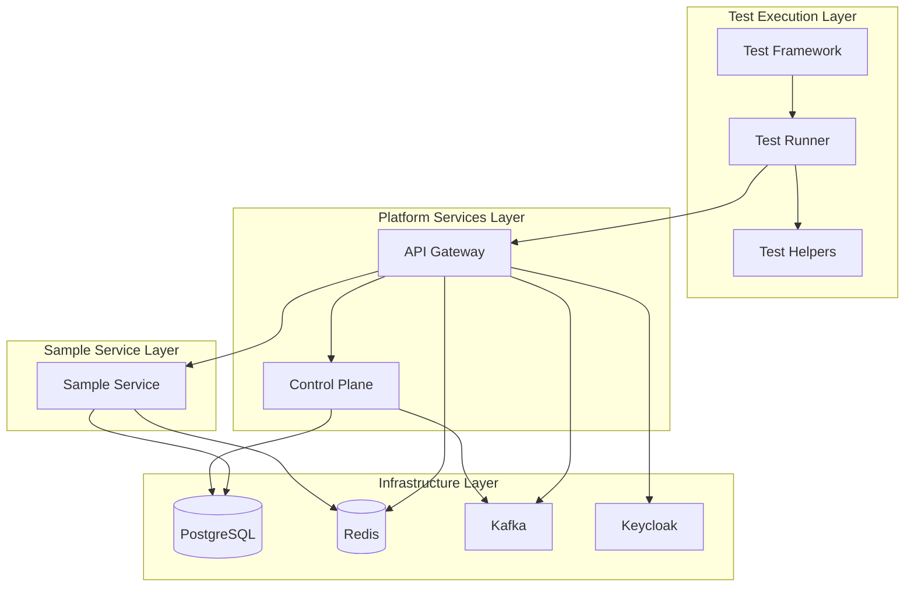

# Design Document: Local Integration Testing

## Overview

The local integration testing suite provides a comprehensive, automated testing environment for the EMF platform. The suite orchestrates multiple Docker containers representing the complete platform stack and executes end-to-end tests that validate the integration between all components.

The design follows a layered approach:
1. **Infrastructure Layer**: PostgreSQL, Redis, Kafka, Keycloak (already defined in docker-compose.yml)
2. **Platform Services Layer**: Control Plane and API Gateway services
3. **Sample Service Layer**: A test domain service implementing JSON:API collections
4. **Test Execution Layer**: Test framework that orchestrates the environment and runs integration tests

The suite is designed to run locally on developer machines and in CI/CD pipelines, providing fast feedback on platform integration issues.

## Architecture

### High-Level Architecture



### Component Responsibilities

**Test Framework**:
- Orchestrates Docker environment startup and shutdown
- Waits for service health checks before running tests
- Provides test data seeding and cleanup utilities
- Generates test reports

**API Gateway**:
- Routes requests to backend services
- Validates JWT tokens from Keycloak
- Enforces authorization policies
- Filters response fields based on policies
- Processes JSON:API include parameters
- Implements rate limiting

**Control Plane**:
- Manages collection definitions
- Manages authorization policies
- Publishes configuration changes to Kafka
- Provides bootstrap endpoint for gateway initialization

**Sample Service**:
- Implements two collections: projects and tasks
- Provides CRUD operations for both collections
- Implements JSON:API relationships
- Caches resources in Redis for include processing
- Registers with control plane on startup

**Infrastructure Services**:
- PostgreSQL: Stores collection data and control plane configuration
- Redis: Caches resources and stores rate limit state
- Kafka: Distributes configuration change events
- Keycloak: Provides OIDC authentication and JWT tokens

### Repository Organization

The integration testing suite will be organized across repositories:

**emf-gateway repository**:
- Integration test framework (Java/JUnit)
- Test orchestration utilities
- Gateway-specific integration tests

**emf-control-plane repository**:
- Control plane integration tests
- Database migration tests

**Root workspace**:
- docker-compose.yml (already exists, will be extended)
- Sample service implementation (new)
- End-to-end test suite (new)
- Test documentation

## Components and Interfaces

### 1. Docker Compose Configuration

**Purpose**: Define and orchestrate all services required for integration testing

**Extension to Existing docker-compose.yml**:
```yaml
services:
  # Existing services: postgres, redis, kafka, keycloak (already defined)
  
  # Control Plane Service
  emf-control-plane:
    build:
      context: ./emf-control-plane
      dockerfile: Dockerfile
    container_name: emf-control-plane
    environment:
      SPRING_PROFILES_ACTIVE: integration-test
      SPRING_DATASOURCE_URL: jdbc:postgresql://postgres:5432/emf_control_plane
      SPRING_DATASOURCE_USERNAME: emf
      SPRING_DATASOURCE_PASSWORD: emf
      SPRING_KAFKA_BOOTSTRAP_SERVERS: kafka:9092
    ports:
      - "8081:8080"
    depends_on:
      postgres:
        condition: service_healthy
      kafka:
        condition: service_healthy
    healthcheck:
      test: ["CMD", "curl", "-f", "http://localhost:8080/actuator/health"]
      interval: 10s
      timeout: 5s
      retries: 10
    networks:
      - emf-network
  
  # API Gateway Service
  emf-gateway:
    build:
      context: ./emf-gateway
      dockerfile: Dockerfile
    container_name: emf-gateway
    environment:
      SPRING_PROFILES_ACTIVE: integration-test
      EMF_GATEWAY_CONTROL_PLANE_URL: http://emf-control-plane:8080
      SPRING_KAFKA_BOOTSTRAP_SERVERS: kafka:9092
      SPRING_DATA_REDIS_HOST: redis
      SPRING_DATA_REDIS_PORT: 6379
      SPRING_SECURITY_OAUTH2_RESOURCESERVER_JWT_ISSUER_URI: http://keycloak:8180/realms/emf
    ports:
      - "8080:8080"
    depends_on:
      emf-control-plane:
        condition: service_healthy
      redis:
        condition: service_healthy
      kafka:
        condition: service_healthy
      keycloak:
        condition: service_healthy
    healthcheck:
      test: ["CMD", "curl", "-f", "http://localhost:8080/actuator/health"]
      interval: 10s
      timeout: 5s
      retries: 10
    networks:
      - emf-network
  
  # Sample Service for Testing
  sample-service:
    build:
      context: ./integration-tests/sample-service
      dockerfile: Dockerfile
    container_name: emf-sample-service
    environment:
      SPRING_PROFILES_ACTIVE: integration-test
      SPRING_DATASOURCE_URL: jdbc:postgresql://postgres:5432/emf_control_plane
      SPRING_DATASOURCE_USERNAME: emf
      SPRING_DATASOURCE_PASSWORD: emf
      SPRING_DATA_REDIS_HOST: redis
      SPRING_DATA_REDIS_PORT: 6379
      EMF_CONTROL_PLANE_URL: http://emf-control-plane:8080
    ports:
      - "8082:8080"
    depends_on:
      postgres:
        condition: service_healthy
      redis:
        condition: service_healthy
      emf-control-plane:
        condition: service_healthy
    healthcheck:
      test: ["CMD", "curl", "-f", "http://localhost:8080/actuator/health"]
      interval: 10s
      timeout: 5s
      retries: 10
    networks:
      - emf-network
```

### 2. Sample Service

**Purpose**: Provide a realistic domain service for testing all platform features using the EMF runtime-core library

**Technology Stack**: Spring Boot, EMF Runtime Core, Spring Web, Spring Data Redis

**Maven Dependencies**:
```xml
<dependency>
    <groupId>com.emf</groupId>
    <artifactId>runtime-core</artifactId>
    <version>1.0.0-SNAPSHOT</version>
</dependency>
```

**Collections Definition**:

The sample service uses the EMF runtime-core library to define collections dynamically without JPA entities. Collections are defined using the `CollectionDefinition` and `FieldDefinition` builders.

**Projects Collection**:
```java
CollectionDefinition projects = new CollectionDefinitionBuilder()
    .name("projects")
    .displayName("Projects")
    .description("Project management collection")
    .addField(FieldDefinition.requiredString("name"))
    .addField(FieldDefinition.string("description"))
    .addField(FieldDefinition.enumField("status", 
        List.of("PLANNING", "ACTIVE", "COMPLETED", "ARCHIVED")))
    .storageConfig(new StorageConfig(StorageMode.PHYSICAL_TABLES, null))
    .apiConfig(new ApiConfig(true, true, true, true, true, "/api/projects"))
    .build();
```

**Tasks Collection**:
```java
CollectionDefinition tasks = new CollectionDefinitionBuilder()
    .name("tasks")
    .displayName("Tasks")
    .description("Task management collection")
    .addField(FieldDefinition.requiredString("title"))
    .addField(FieldDefinition.string("description"))
    .addField(FieldDefinition.bool("completed", false))
    .addField(FieldDefinition.reference("project_id", "projects"))
    .storageConfig(new StorageConfig(StorageMode.PHYSICAL_TABLES, null))
    .apiConfig(new ApiConfig(true, true, true, true, true, "/api/tasks"))
    .build();
```

**REST Controllers**:

The sample service uses the `DynamicCollectionRouter` from runtime-core, which automatically provides REST endpoints for all registered collections. No custom controllers are needed - the router handles all CRUD operations:

- `GET /api/collections/{collectionName}` - List with pagination, sorting, filtering
- `GET /api/collections/{collectionName}/{id}` - Get single resource
- `POST /api/collections/{collectionName}` - Create resource
- `PUT /api/collections/{collectionName}/{id}` - Update resource
- `DELETE /api/collections/{collectionName}/{id}` - Delete resource

The `DynamicCollectionRouter` is automatically configured by the `EmfRuntimeAutoConfiguration` when runtime-core is on the classpath.

**Collection Registration and Initialization**:
```java
@Component
public class CollectionInitializer {
    
    @Autowired
    private CollectionRegistry registry;
    
    @Autowired
    private StorageAdapter storageAdapter;
    
    @Autowired
    private RestTemplate restTemplate;
    
    @Value("${emf.control-plane.url}")
    private String controlPlaneUrl;
    
    @EventListener(ApplicationReadyEvent.class)
    public void initializeCollections() {
        // Define projects collection
        CollectionDefinition projects = new CollectionDefinitionBuilder()
            .name("projects")
            .displayName("Projects")
            .description("Project management collection")
            .addField(FieldDefinition.requiredString("name"))
            .addField(FieldDefinition.string("description"))
            .addField(FieldDefinition.enumField("status", 
                List.of("PLANNING", "ACTIVE", "COMPLETED", "ARCHIVED")))
            .storageConfig(new StorageConfig(StorageMode.PHYSICAL_TABLES, null))
            .apiConfig(new ApiConfig(true, true, true, true, true, "/api/collections/projects"))
            .build();
        
        // Define tasks collection
        CollectionDefinition tasks = new CollectionDefinitionBuilder()
            .name("tasks")
            .displayName("Tasks")
            .description("Task management collection")
            .addField(FieldDefinition.requiredString("title"))
            .addField(FieldDefinition.string("description"))
            .addField(FieldDefinition.bool("completed", false))
            .addField(FieldDefinition.reference("project_id", "projects"))
            .storageConfig(new StorageConfig(StorageMode.PHYSICAL_TABLES, null))
            .apiConfig(new ApiConfig(true, true, true, true, true, "/api/collections/tasks"))
            .build();
        
        // Register collections in local registry
        registry.register(projects);
        registry.register(tasks);
        
        // Initialize storage (creates tables)
        storageAdapter.initializeCollection(projects);
        storageAdapter.initializeCollection(tasks);
        
        // Register service with control plane
        registerWithControlPlane(projects, tasks);
    }
    
    private void registerWithControlPlane(CollectionDefinition... collections) {
        // Register service
        ServiceRegistrationRequest serviceRequest = new ServiceRegistrationRequest(
            "sample-service",
            "Sample Service",
            "http://sample-service:8080"
        );
        restTemplate.postForEntity(
            controlPlaneUrl + "/control/services",
            serviceRequest,
            Void.class
        );
        
        // Register each collection with control plane
        for (CollectionDefinition collection : collections) {
            CollectionRegistrationRequest request = new CollectionRegistrationRequest(
                collection.name(),
                "sample-service",
                collection.apiConfig().basePath(),
                collection.fields().stream()
                    .map(f -> new FieldDefinition(f.name(), f.type().name(), !f.nullable()))
                    .toList(),
                extractRelationships(collection)
            );
            restTemplate.postForEntity(
                controlPlaneUrl + "/control/collections",
                request,
                Void.class
            );
        }
    }
    
    private List<RelationshipDefinition> extractRelationships(CollectionDefinition collection) {
        return collection.fields().stream()
            .filter(f -> f.referenceConfig() != null)
            .map(f -> new RelationshipDefinition(
                f.name(),
                f.referenceConfig().targetCollection(),
                "belongsTo"
            ))
            .toList();
    }
}
```

**Redis Caching for Include Processing**:

The sample service uses Redis to cache resources for JSON:API include parameter processing. The runtime-core library handles the core CRUD operations, but include processing requires additional caching logic.

```java
@Service
public class ResourceCacheService {
    
    @Autowired
    private RedisTemplate<String, String> redisTemplate;
    
    @Autowired
    private ObjectMapper objectMapper;
    
    @Autowired
    private QueryEngine queryEngine;
    
    @Autowired
    private CollectionRegistry registry;
    
    /**
     * Caches a resource after creation or update.
     * Called by event listeners on collection events.
     */
    public void cacheResource(String type, String id, Map<String, Object> resource) {
        String key = String.format("jsonapi:%s:%s", type, id);
        try {
            String json = objectMapper.writeValueAsString(resource);
            redisTemplate.opsForValue().set(key, json, Duration.ofMinutes(10));
        } catch (JsonProcessingException e) {
            // Log error but don't fail the request
            log.warn("Failed to cache resource {}:{}", type, id, e);
        }
    }
    
    /**
     * Retrieves a cached resource.
     * Used for include parameter processing.
     */
    public Optional<Map<String, Object>> getCachedResource(String type, String id) {
        String key = String.format("jsonapi:%s:%s", type, id);
        String json = redisTemplate.opsForValue().get(key);
        if (json != null) {
            try {
                return Optional.of(objectMapper.readValue(json, 
                    new TypeReference<Map<String, Object>>() {}));
            } catch (JsonProcessingException e) {
                log.warn("Failed to deserialize cached resource {}:{}", type, id, e);
                return Optional.empty();
            }
        }
        return Optional.empty();
    }
    
    /**
     * Invalidates a cached resource.
     * Called on resource update or delete.
     */
    public void invalidateResource(String type, String id) {
        String key = String.format("jsonapi:%s:%s", type, id);
        redisTemplate.delete(key);
    }
}

/**
 * Event listener that caches resources on create/update and invalidates on delete.
 */
@Component
public class CacheEventListener implements CollectionChangeListener {
    
    @Autowired
    private ResourceCacheService cacheService;
    
    @EventListener
    public void onCollectionEvent(CollectionEvent event) {
        String type = event.getCollectionName();
        String id = event.getResourceId();
        
        switch (event.getEventType()) {
            case CREATE, UPDATE -> {
                Map<String, Object> resource = event.getResourceData();
                cacheService.cacheResource(type, id, resource);
            }
            case DELETE -> {
                cacheService.invalidateResource(type, id);
            }
        }
    }
}
```

**Include Parameter Processing**:

The sample service extends the `DynamicCollectionRouter` to add include parameter support:

```java
@RestController
@RequestMapping("/api/collections")
public class EnhancedCollectionRouter extends DynamicCollectionRouter {
    
    @Autowired
    private ResourceCacheService cacheService;
    
    public EnhancedCollectionRouter(CollectionRegistry registry, QueryEngine queryEngine) {
        super(registry, queryEngine);
    }
    
    @Override
    @GetMapping("/{collectionName}/{id}")
    public ResponseEntity<Map<String, Object>> get(
            @PathVariable String collectionName,
            @PathVariable String id,
            @RequestParam(required = false) String include) {
        
        // Get the primary resource using parent implementation
        ResponseEntity<Map<String, Object>> response = super.get(collectionName, id);
        
        if (response.getStatusCode() != HttpStatus.OK || include == null) {
            return response;
        }
        
        // Process include parameter
        Map<String, Object> body = response.getBody();
        Map<String, Object> data = (Map<String, Object>) body.get("data");
        
        List<Map<String, Object>> included = new ArrayList<>();
        String[] includeParams = include.split(",");
        
        for (String includeParam : includeParams) {
            processInclude(data, includeParam.trim(), included);
        }
        
        if (!included.isEmpty()) {
            body.put("included", included);
        }
        
        return ResponseEntity.ok(body);
    }
    
    private void processInclude(Map<String, Object> data, 
                                 String includeParam, 
                                 List<Map<String, Object>> included) {
        Map<String, Object> relationships = 
            (Map<String, Object>) data.get("relationships");
        
        if (relationships == null || !relationships.containsKey(includeParam)) {
            return; // Invalid include parameter, ignore
        }
        
        Map<String, Object> relationship = 
            (Map<String, Object>) relationships.get(includeParam);
        Map<String, Object> relationshipData = 
            (Map<String, Object>) relationship.get("data");
        
        if (relationshipData == null) {
            return; // No related resource
        }
        
        String relatedType = (String) relationshipData.get("type");
        String relatedId = (String) relationshipData.get("id");
        
        // Try to get from cache
        Optional<Map<String, Object>> cached = 
            cacheService.getCachedResource(relatedType, relatedId);
        
        if (cached.isPresent()) {
            included.add(cached.get());
        }
        // If not in cache, silently skip (cache miss handling)
    }
}
```

### 3. Test Framework

**Purpose**: Orchestrate test environment and provide utilities for writing integration tests

**Technology Stack**: JUnit 5, Testcontainers (optional), RestAssured, Awaitility

**Test Base Class**:
```java
@SpringBootTest(webEnvironment = SpringBootTest.WebEnvironment.NONE)
@ActiveProfiles("integration-test")
public abstract class IntegrationTestBase {
    
    protected static final String GATEWAY_URL = "http://localhost:8080";
    protected static final String CONTROL_PLANE_URL = "http://localhost:8081";
    protected static final String SAMPLE_SERVICE_URL = "http://localhost:8082";
    protected static final String KEYCLOAK_URL = "http://localhost:8180";
    
    protected RestTemplate restTemplate;
    protected ObjectMapper objectMapper;
    
    @BeforeAll
    public static void waitForServices() {
        // Wait for all services to be healthy
        Awaitility.await()
            .atMost(Duration.ofMinutes(2))
            .pollInterval(Duration.ofSeconds(5))
            .until(() -> {
                return isServiceHealthy(GATEWAY_URL) &&
                       isServiceHealthy(CONTROL_PLANE_URL) &&
                       isServiceHealthy(SAMPLE_SERVICE_URL);
            });
    }
    
    @BeforeEach
    public void setUp() {
        restTemplate = new RestTemplate();
        objectMapper = new ObjectMapper();
    }
    
    @AfterEach
    public void tearDown() {
        // Clean up test data
        cleanupTestData();
    }
    
    protected static boolean isServiceHealthy(String baseUrl) {
        try {
            RestTemplate template = new RestTemplate();
            ResponseEntity<String> response = template.getForEntity(
                baseUrl + "/actuator/health",
                String.class
            );
            return response.getStatusCode() == HttpStatus.OK;
        } catch (Exception e) {
            return false;
        }
    }
    
    protected void cleanupTestData() {
        // Delete all test resources
        // This will be implemented by subclasses
    }
}
```

**Authentication Helper**:
```java
@Component
public class AuthenticationHelper {
    
    private static final String KEYCLOAK_TOKEN_URL = 
        "http://localhost:8180/realms/emf/protocol/openid-connect/token";
    
    private RestTemplate restTemplate = new RestTemplate();
    
    public String getAdminToken() {
        return getToken("admin", "admin");
    }
    
    public String getUserToken() {
        return getToken("user", "user");
    }
    
    public String getToken(String username, String password) {
        MultiValueMap<String, String> params = new LinkedMultiValueMap<>();
        params.add("grant_type", "password");
        params.add("client_id", "emf-client");
        params.add("username", username);
        params.add("password", password);
        
        HttpHeaders headers = new HttpHeaders();
        headers.setContentType(MediaType.APPLICATION_FORM_URLENCODED);
        
        HttpEntity<MultiValueMap<String, String>> request = 
            new HttpEntity<>(params, headers);
        
        ResponseEntity<Map> response = restTemplate.postForEntity(
            KEYCLOAK_TOKEN_URL,
            request,
            Map.class
        );
        
        return (String) response.getBody().get("access_token");
    }
    
    public HttpHeaders createAuthHeaders(String token) {
        HttpHeaders headers = new HttpHeaders();
        headers.setBearerAuth(token);
        headers.setContentType(MediaType.APPLICATION_JSON);
        return headers;
    }
}
```

**Test Data Helper**:
```java
@Component
public class TestDataHelper {
    
    @Autowired
    private RestTemplate restTemplate;
    
    @Autowired
    private AuthenticationHelper authHelper;
    
    private static final String GATEWAY_URL = "http://localhost:8080";
    
    public String createProject(String name, String description, String status) {
        String token = authHelper.getAdminToken();
        HttpHeaders headers = authHelper.createAuthHeaders(token);
        
        Map<String, Object> projectData = Map.of(
            "data", Map.of(
                "type", "projects",
                "attributes", Map.of(
                    "name", name,
                    "description", description,
                    "status", status
                )
            )
        );
        
        HttpEntity<Map<String, Object>> request = new HttpEntity<>(projectData, headers);
        
        ResponseEntity<Map> response = restTemplate.postForEntity(
            GATEWAY_URL + "/api/projects",
            request,
            Map.class
        );
        
        Map<String, Object> data = (Map<String, Object>) response.getBody().get("data");
        return (String) data.get("id");
    }
    
    public String createTask(String title, String description, String projectId) {
        String token = authHelper.getAdminToken();
        HttpHeaders headers = authHelper.createAuthHeaders(token);
        
        Map<String, Object> taskData = Map.of(
            "data", Map.of(
                "type", "tasks",
                "attributes", Map.of(
                    "title", title,
                    "description", description,
                    "completed", false
                ),
                "relationships", Map.of(
                    "project", Map.of(
                        "data", Map.of(
                            "type", "projects",
                            "id", projectId
                        )
                    )
                )
            )
        );
        
        HttpEntity<Map<String, Object>> request = new HttpEntity<>(taskData, headers);
        
        ResponseEntity<Map> response = restTemplate.postForEntity(
            GATEWAY_URL + "/api/tasks",
            request,
            Map.class
        );
        
        Map<String, Object> data = (Map<String, Object>) response.getBody().get("data");
        return (String) data.get("id");
    }
    
    public void deleteProject(String projectId) {
        String token = authHelper.getAdminToken();
        HttpHeaders headers = authHelper.createAuthHeaders(token);
        
        HttpEntity<Void> request = new HttpEntity<>(headers);
        
        restTemplate.exchange(
            GATEWAY_URL + "/api/projects/" + projectId,
            HttpMethod.DELETE,
            request,
            Void.class
        );
    }
    
    public void deleteTask(String taskId) {
        String token = authHelper.getAdminToken();
        HttpHeaders headers = authHelper.createAuthHeaders(token);
        
        HttpEntity<Void> request = new HttpEntity<>(headers);
        
        restTemplate.exchange(
            GATEWAY_URL + "/api/tasks/" + taskId,
            HttpMethod.DELETE,
            request,
            Void.class
        );
    }
}
```

### 4. Integration Test Suites

**Collection CRUD Tests**:
```java
public class CollectionCrudIntegrationTest extends IntegrationTestBase {
    
    @Autowired
    private AuthenticationHelper authHelper;
    
    @Autowired
    private TestDataHelper testDataHelper;
    
    private List<String> createdProjectIds = new ArrayList<>();
    private List<String> createdTaskIds = new ArrayList<>();
    
    @Override
    protected void cleanupTestData() {
        createdTaskIds.forEach(testDataHelper::deleteTask);
        createdProjectIds.forEach(testDataHelper::deleteProject);
        createdTaskIds.clear();
        createdProjectIds.clear();
    }
    
    @Test
    void testCreateProject() {
        // Test creating a project
    }
    
    @Test
    void testReadProject() {
        // Test reading a project
    }
    
    @Test
    void testUpdateProject() {
        // Test updating a project
    }
    
    @Test
    void testDeleteProject() {
        // Test deleting a project
    }
    
    @Test
    void testListProjects() {
        // Test listing projects with pagination
    }
}
```

**Authentication Tests**:
```java
public class AuthenticationIntegrationTest extends IntegrationTestBase {
    
    @Test
    void testRequestWithoutToken_Returns401() {
        // Test unauthenticated request
    }
    
    @Test
    void testRequestWithInvalidToken_Returns401() {
        // Test invalid token
    }
    
    @Test
    void testRequestWithValidToken_Succeeds() {
        // Test valid token
    }
    
    @Test
    void testTokenAcquisitionFromKeycloak() {
        // Test getting token from Keycloak
    }
}
```

**Authorization Tests**:
```java
public class AuthorizationIntegrationTest extends IntegrationTestBase {
    
    @Test
    void testAdminCanAccessAdminRoute() {
        // Test admin access
    }
    
    @Test
    void testUserCannotAccessAdminRoute() {
        // Test user denied access
    }
    
    @Test
    void testFieldFilteringBasedOnRole() {
        // Test field visibility
    }
}
```

**Related Collections Tests**:
```java
public class RelatedCollectionsIntegrationTest extends IntegrationTestBase {
    
    @Test
    void testCreateTaskWithProjectRelationship() {
        // Test creating related resources
    }
    
    @Test
    void testReadTaskWithProjectRelationship() {
        // Test reading relationships
    }
    
    @Test
    void testUpdateTaskRelationship() {
        // Test updating relationships
    }
}
```

**Include Parameter Tests**:
```java
public class IncludeParameterIntegrationTest extends IntegrationTestBase {
    
    @Test
    void testIncludeSingleRelationship() {
        // Test include=project
    }
    
    @Test
    void testIncludeMultipleRelationships() {
        // Test include=project,tasks
    }
    
    @Test
    void testIncludeWithFieldFiltering() {
        // Test that field policies apply to included resources
    }
}
```

**End-to-End Flow Tests**:
```java
public class EndToEndFlowIntegrationTest extends IntegrationTestBase {
    
    @Test
    void testCompleteProjectLifecycle() {
        // 1. Authenticate
        // 2. Create project
        // 3. Create tasks for project
        // 4. Read project with included tasks
        // 5. Update project
        // 6. Delete tasks
        // 7. Delete project
    }
}
```

## Data Models

### JSON:API Request/Response Format

**Create Request**:
```json
{
  "data": {
    "type": "projects",
    "attributes": {
      "name": "New Project",
      "description": "Project description",
      "status": "PLANNING"
    }
  }
}
```

**Create Response**:
```json
{
  "data": {
    "type": "projects",
    "id": "123e4567-e89b-12d3-a456-426614174000",
    "attributes": {
      "name": "New Project",
      "description": "Project description",
      "status": "PLANNING",
      "createdAt": "2024-01-15T10:30:00Z"
    },
    "relationships": {
      "tasks": {
        "data": []
      }
    }
  }
}
```

**Read with Include**:
```
GET /api/projects/123?include=tasks
```

**Response with Include**:
```json
{
  "data": {
    "type": "projects",
    "id": "123",
    "attributes": {
      "name": "New Project",
      "description": "Project description",
      "status": "ACTIVE"
    },
    "relationships": {
      "tasks": {
        "data": [
          {"type": "tasks", "id": "456"},
          {"type": "tasks", "id": "789"}
        ]
      }
    }
  },
  "included": [
    {
      "type": "tasks",
      "id": "456",
      "attributes": {
        "title": "Task 1",
        "description": "First task",
        "completed": false
      }
    },
    {
      "type": "tasks",
      "id": "789",
      "attributes": {
        "title": "Task 2",
        "description": "Second task",
        "completed": true
      }
    }
  ]
}
```

### Test Data Seeding

**Keycloak Realm Configuration** (docker/keycloak/emf-realm.json):
```json
{
  "realm": "emf",
  "enabled": true,
  "users": [
    {
      "username": "admin",
      "enabled": true,
      "credentials": [{"type": "password", "value": "admin"}],
      "realmRoles": ["ADMIN", "USER"]
    },
    {
      "username": "user",
      "enabled": true,
      "credentials": [{"type": "password", "value": "user"}],
      "realmRoles": ["USER"]
    },
    {
      "username": "guest",
      "enabled": true,
      "credentials": [{"type": "password", "value": "guest"}],
      "realmRoles": []
    }
  ],
  "clients": [
    {
      "clientId": "emf-client",
      "enabled": true,
      "publicClient": true,
      "directAccessGrantsEnabled": true,
      "redirectUris": ["*"]
    }
  ]
}
```

**Database Initialization** (docker/postgres/init.sql):

The EMF runtime-core library automatically creates tables for collections when using `StorageMode.PHYSICAL_TABLES`. The `StorageAdapter.initializeCollection()` method generates and executes the appropriate CREATE TABLE statements based on the collection definition.

However, we still need to ensure the database exists and has the necessary extensions:

```sql
-- Ensure database exists
CREATE DATABASE IF NOT EXISTS emf_control_plane;

-- Enable UUID extension for ID generation
CREATE EXTENSION IF NOT EXISTS "uuid-ossp";

-- The runtime-core library will automatically create:
-- - projects table with columns: id, name, description, status, created_at, updated_at
-- - tasks table with columns: id, title, description, completed, project_id, created_at, updated_at
-- - Foreign key constraint from tasks.project_id to projects.id
-- - Indexes for foreign keys and unique constraints
```

The sample service's `CollectionInitializer` component calls `storageAdapter.initializeCollection()` for each collection on startup, which creates the tables if they don't exist.


## Correctness Properties

A property is a characteristic or behavior that should hold true across all valid executions of a system—essentially, a formal statement about what the system should do. Properties serve as the bridge between human-readable specifications and machine-verifiable correctness guarantees.

### Property Reflection

After analyzing all acceptance criteria, several properties can be combined or are logically redundant:

- Properties about authentication (5.1-5.4) can be combined into a single comprehensive authentication property
- Properties about authorization (6.1-6.2) can be combined into a single authorization property
- Properties about field filtering (6.3, 6.4, 6.7, 8.7) can be combined since they all test the same mechanism
- Properties about caching (2.8, 8.2, 11.1-11.3) can be combined into cache consistency properties
- Properties about event publishing (4.2, 12.1, 12.3, 12.5) can be combined into a single event publishing property
- Properties about event processing (4.3, 12.2, 12.4, 12.6) can be combined into a single event processing property
- Properties about persistence (4.1, 7.2, 9.3, 9.7, 9.9) can be combined into CRUD persistence properties
- Properties about error handling (2.10, 9.10, 13.1-13.3, 13.8) can be combined into validation and error format properties

### Core Properties

**Property 1: JSON:API Response Format Compliance**
*For any* successful response from the Sample Service, the response body SHALL conform to the JSON:API specification with a "data" field containing type, id, and attributes.
**Validates: Requirements 2.6**

**Property 2: Resource Caching Consistency**
*For any* resource created or updated in the Sample Service, the resource SHALL be cached in Redis with the key pattern "jsonapi:{type}:{id}" and SHALL be retrievable from cache.
**Validates: Requirements 2.8, 8.2, 11.1, 11.2, 11.3**

**Property 3: Required Field Validation**
*For any* create request with missing required fields, the Sample Service SHALL return HTTP 400 with error details in JSON:API error format.
**Validates: Requirements 2.9, 13.2**

**Property 4: Invalid Data Rejection**
*For any* request with invalid JSON or invalid field types, the service SHALL return HTTP 400 with error details in JSON:API error format.
**Validates: Requirements 2.10, 13.1, 13.3, 13.8**

**Property 5: Collection Persistence**
*For any* collection created via the Control Plane API, the collection SHALL be stored in the database and SHALL be retrievable via subsequent queries.
**Validates: Requirements 4.1**

**Property 6: Configuration Event Publishing**
*For any* configuration change (collection, authorization policy, or service), the Control Plane SHALL publish a corresponding change event to Kafka.
**Validates: Requirements 4.2, 12.1, 12.3, 12.5**

**Property 7: Configuration Event Processing**
*For any* configuration change event received from Kafka, the Gateway SHALL process the event and update its internal configuration (routes, authorization policies) accordingly.
**Validates: Requirements 4.3, 12.2, 12.4, 12.6**

**Property 8: Request Routing Correctness**
*For any* authenticated request to a registered collection path, the Gateway SHALL route the request to the correct backend service based on the collection's service mapping.
**Validates: Requirements 4.4**

**Property 9: Invalid Collection Rejection**
*For any* collection definition with missing required fields (service ID, path, or name), the Control Plane SHALL reject the collection with an appropriate error response.
**Validates: Requirements 4.7**

**Property 10: Authentication Token Validation**
*For any* request without a valid JWT token (missing, invalid, or expired), the Gateway SHALL return HTTP 401 Unauthorized.
**Validates: Requirements 5.1, 5.2, 5.3**

**Property 11: Valid Token Acceptance**
*For any* request with a valid JWT token, the Gateway SHALL extract the user identity and roles from the token and allow the request to proceed to authorization checks.
**Validates: Requirements 5.4, 5.5, 5.6**

**Property 12: Route Authorization Enforcement**
*For any* request to a route with an authorization policy, the Gateway SHALL allow access if the user satisfies the policy and SHALL return HTTP 403 Forbidden if the user does not satisfy the policy.
**Validates: Requirements 6.1, 6.2**

**Property 13: Field-Level Authorization**
*For any* response containing fields with field policies, the Gateway SHALL filter out fields that the user is not authorized to view based on their roles, applying this filtering to both primary data and included resources.
**Validates: Requirements 6.3, 6.4, 6.7, 8.7**

**Property 14: Dynamic Authorization Updates**
*For any* authorization policy update event, the Gateway SHALL update its authorization cache and SHALL enforce the new policy on subsequent requests without requiring a restart.
**Validates: Requirements 6.8, 12.7**

**Property 15: Relationship Persistence**
*For any* resource created or updated with relationship data, the relationship SHALL be stored in the database and SHALL be included in the relationships section of subsequent GET responses.
**Validates: Requirements 7.2, 7.3**

**Property 16: Relationship Integrity**
*For any* relationship operation (create, update, delete), the system SHALL maintain referential integrity such that relationships only reference existing resources.
**Validates: Requirements 7.6**

**Property 17: Include Parameter Processing**
*For any* GET request with an include parameter, the Gateway SHALL embed the related resources in the "included" array of the response, fetching them from Redis cache.
**Validates: Requirements 8.1, 8.3**

**Property 18: Cache Miss Handling**
*For any* include processing where a related resource is not found in cache, the Gateway SHALL handle the miss gracefully by omitting that resource from the included array without failing the request.
**Validates: Requirements 8.6, 11.5**

**Property 19: Invalid Include Parameter Handling**
*For any* request with invalid include parameters (non-existent relationships), the Gateway SHALL ignore the invalid parameters and process only valid ones.
**Validates: Requirements 8.8**

**Property 20: Resource ID Uniqueness**
*For any* resource created via POST, the system SHALL assign a unique ID that does not conflict with any existing resource of the same type.
**Validates: Requirements 9.2**

**Property 21: CRUD Persistence**
*For any* resource created via POST, the resource SHALL be stored in the database; for any resource updated via PATCH, the changes SHALL be persisted; for any resource deleted via DELETE, the resource SHALL be removed from the database.
**Validates: Requirements 9.3, 9.7, 9.9**

**Property 22: Non-Existent Resource Handling**
*For any* operation (GET, PATCH, DELETE) on a non-existent resource ID, the service SHALL return HTTP 404 Not Found.
**Validates: Requirements 9.10**

**Property 23: Cache TTL Configuration**
*For any* resource cached in Redis, the cache entry SHALL have a TTL value set to prevent indefinite cache growth.
**Validates: Requirements 11.4**

**Property 24: Cache Invalidation on Update**
*For any* resource updated via PATCH, the system SHALL invalidate or update the cached version in Redis.
**Validates: Requirements 11.6**

**Property 25: Cache Invalidation on Delete**
*For any* resource deleted via DELETE, the system SHALL remove the cached version from Redis.
**Validates: Requirements 11.7**

**Property 26: Malformed Event Handling**
*For any* malformed Kafka event received by the Gateway, the Gateway SHALL log the error and continue processing other events without crashing.
**Validates: Requirements 12.8**

**Property 27: Backend Error Propagation**
*For any* error response from a backend service, the Gateway SHALL propagate the error response to the client with the same status code and body.
**Validates: Requirements 13.4**

**Property 28: Infrastructure Failure Resilience**
*For any* temporary failure of infrastructure services (Redis, Kafka), the Gateway SHALL handle the failure gracefully by logging the error and degrading functionality rather than failing completely.
**Validates: Requirements 13.5, 13.6, 13.7**

## Error Handling

### Error Categories

**Validation Errors (HTTP 400)**:
- Invalid JSON syntax
- Missing required fields
- Invalid field types
- Invalid relationship references
- Invalid include parameters (logged but not returned as errors)

**Authentication Errors (HTTP 401)**:
- Missing Authorization header
- Invalid JWT token format
- Expired JWT token
- Invalid JWT signature

**Authorization Errors (HTTP 403)**:
- User does not satisfy route policy
- User does not have required roles

**Not Found Errors (HTTP 404)**:
- Resource does not exist
- Collection route not registered
- Relationship target not found

**Rate Limiting Errors (HTTP 429)**:
- Request rate exceeds configured limit
- Includes Retry-After header

**Server Errors (HTTP 500)**:
- Database connection failure
- Unexpected internal errors
- Configuration errors

### Error Response Format

All errors follow JSON:API error format:

```json
{
  "errors": [
    {
      "status": "400",
      "code": "VALIDATION_ERROR",
      "title": "Validation Failed",
      "detail": "The 'name' field is required",
      "source": {
        "pointer": "/data/attributes/name"
      }
    }
  ]
}
```

### Graceful Degradation

**Redis Unavailable**:
- Include processing: Skip cached resources, return primary data only
- Rate limiting: Allow requests through (fail open)
- Log warnings for monitoring

**Kafka Unavailable**:
- Configuration updates: Use last known good configuration
- Log errors for monitoring
- Retry connection with exponential backoff

**Database Unavailable**:
- Return HTTP 503 Service Unavailable
- Include Retry-After header
- Log critical errors

**Backend Service Unavailable**:
- Return HTTP 503 Service Unavailable
- Propagate backend error details
- Log errors with service identifier

## Testing Strategy

### Dual Testing Approach

The integration test suite uses both unit tests and property-based tests:

**Unit Tests**:
- Specific example scenarios (e.g., "create project with valid data")
- Edge cases (e.g., "empty project name", "null description")
- Integration points (e.g., "service registration on startup")
- Error conditions (e.g., "database connection failure")

**Property-Based Tests**:
- Universal properties across all inputs (e.g., "all responses follow JSON:API format")
- Randomized input generation for comprehensive coverage
- Minimum 100 iterations per property test
- Each test tagged with: **Feature: local-integration-testing, Property {number}: {property_text}**

### Test Organization

**Infrastructure Tests** (integration-tests/infrastructure/):
- Docker environment setup and teardown
- Service health checks
- Network connectivity
- Database schema validation

**Sample Service Tests** (integration-tests/sample-service/):
- Collection CRUD operations
- Relationship handling
- JSON:API format compliance
- Redis caching behavior

**Gateway Integration Tests** (emf-gateway/src/test/java/integration/):
- Authentication flows
- Authorization enforcement
- Request routing
- Field filtering
- Include processing
- Rate limiting

**Control Plane Integration Tests** (emf-control-plane/src/test/java/integration/):
- Collection management
- Authorization policy management
- Kafka event publishing
- Bootstrap endpoint

**End-to-End Tests** (integration-tests/e2e/):
- Complete request flows through all components
- Multi-step scenarios (create project → create tasks → read with includes)
- Configuration update propagation
- Error handling across components

### Test Execution

**Local Development**:
```bash
# Start environment and run all tests
./run-integration-tests.sh

# Run specific test category
./run-integration-tests.sh --category=authentication

# Run tests in watch mode
./run-integration-tests.sh --watch

# Run with verbose logging
./run-integration-tests.sh --verbose
```

**CI/CD Pipeline**:
```yaml
integration-tests:
  runs-on: ubuntu-latest
  steps:
    - uses: actions/checkout@v3
    - name: Start Docker environment
      run: docker-compose up -d
    - name: Wait for services
      run: ./wait-for-services.sh
    - name: Run integration tests
      run: ./run-integration-tests.sh --ci
    - name: Collect logs
      if: failure()
      run: docker-compose logs > test-logs.txt
    - name: Upload logs
      if: failure()
      uses: actions/upload-artifact@v3
      with:
        name: test-logs
        path: test-logs.txt
    - name: Cleanup
      if: always()
      run: docker-compose down -v
```

### Property-Based Testing Configuration

**Framework**: JUnit 5 + jqwik (Java property-based testing library)

**Configuration**:
```java
@Property(tries = 100)
@Tag("Feature: local-integration-testing")
@Tag("Property 1: JSON:API Response Format Compliance")
void testJsonApiResponseFormat(@ForAll("validProjects") Project project) {
    // Test that all responses follow JSON:API format
}

@Provide
Arbitrary<Project> validProjects() {
    return Combinators.combine(
        Arbitraries.strings().alpha().ofMinLength(1).ofMaxLength(100),
        Arbitraries.strings().ofMaxLength(500),
        Arbitraries.of(ProjectStatus.values())
    ).as((name, description, status) -> 
        new Project(name, description, status)
    );
}
```

**Test Data Generators**:
- Random project names, descriptions, statuses
- Random task titles, descriptions, completion states
- Random user roles and permissions
- Random include parameters
- Invalid data for error testing

### Test Isolation

**Before Each Test**:
- Clear test data from database
- Clear Redis cache
- Reset Kafka consumer offsets
- Generate unique test identifiers

**After Each Test**:
- Delete created resources
- Restore original configuration
- Clear caches
- Collect metrics

**Between Test Runs**:
- Stop all Docker containers
- Remove Docker volumes
- Clear Docker networks
- Reset database schema

### Performance Targets

- Full test suite: < 5 minutes
- Individual test: < 10 seconds
- Service startup: < 30 seconds
- Health check convergence: < 60 seconds

### Test Reporting

**Console Output**:
- Progress indicators
- Pass/fail status
- Error messages
- Execution time

**JUnit XML Report**:
- Test results for CI/CD integration
- Failure details
- Stack traces

**HTML Report**:
- Visual test results
- Coverage metrics
- Performance graphs
- Failure analysis

**Logs**:
- Service logs for each test
- Request/response logs
- Error logs
- Performance metrics

## Deployment and Operations

### Local Development Setup

**Prerequisites**:
- Docker 20.10+
- Docker Compose 2.0+
- Java 21 (for running tests)
- Maven 3.8+ (for building services)

**Initial Setup**:
```bash
# Clone repositories
git clone <workspace-url>
cd workspace

# Build all services
./build-all.sh

# Start infrastructure
docker-compose up -d postgres redis kafka keycloak

# Wait for infrastructure
./wait-for-infrastructure.sh

# Build and start platform services
docker-compose up -d emf-control-plane emf-gateway sample-service

# Wait for services
./wait-for-services.sh

# Run tests
./run-integration-tests.sh
```

### Continuous Integration

**GitHub Actions Workflow**:
```yaml
name: Integration Tests

on:
  push:
    branches: [main, develop]
  pull_request:
    branches: [main, develop]

jobs:
  integration-tests:
    runs-on: ubuntu-latest
    timeout-minutes: 15
    
    steps:
      - uses: actions/checkout@v3
      
      - name: Set up Java
        uses: actions/setup-java@v3
        with:
          java-version: '21'
          distribution: 'temurin'
      
      - name: Cache Docker layers
        uses: actions/cache@v3
        with:
          path: /tmp/.buildx-cache
          key: ${{ runner.os }}-buildx-${{ github.sha }}
          restore-keys: |
            ${{ runner.os }}-buildx-
      
      - name: Build services
        run: ./build-all.sh
      
      - name: Start Docker environment
        run: docker-compose up -d
      
      - name: Wait for services
        run: ./wait-for-services.sh
      
      - name: Run integration tests
        run: ./run-integration-tests.sh --ci
      
      - name: Collect logs
        if: failure()
        run: |
          docker-compose logs > test-logs.txt
          docker ps -a > containers.txt
      
      - name: Upload artifacts
        if: failure()
        uses: actions/upload-artifact@v3
        with:
          name: test-artifacts
          path: |
            test-logs.txt
            containers.txt
            target/surefire-reports/
      
      - name: Cleanup
        if: always()
        run: docker-compose down -v
```

### Troubleshooting

**Services Not Starting**:
```bash
# Check service logs
docker-compose logs <service-name>

# Check service health
docker-compose ps

# Restart specific service
docker-compose restart <service-name>

# Rebuild and restart
docker-compose up -d --build <service-name>
```

**Tests Failing**:
```bash
# Run with verbose logging
./run-integration-tests.sh --verbose

# Run specific test
./run-integration-tests.sh --test=CollectionCrudIntegrationTest

# Check service connectivity
curl http://localhost:8080/actuator/health
curl http://localhost:8081/actuator/health
curl http://localhost:8082/actuator/health
```

**Performance Issues**:
```bash
# Check resource usage
docker stats

# Increase Docker resources (Docker Desktop)
# Settings → Resources → Increase CPU/Memory

# Clean up Docker
docker system prune -a
docker volume prune
```

### Maintenance

**Updating Test Data**:
- Modify docker/keycloak/emf-realm.json for user changes
- Modify docker/postgres/init.sql for schema changes
- Rebuild containers: `docker-compose up -d --build`

**Adding New Tests**:
- Create test class extending IntegrationTestBase
- Implement test methods with @Test annotation
- Add cleanup logic in tearDown()
- Tag property tests appropriately

**Updating Services**:
- Rebuild service: `docker-compose build <service-name>`
- Restart service: `docker-compose up -d <service-name>`
- Verify health: `curl http://localhost:<port>/actuator/health`
