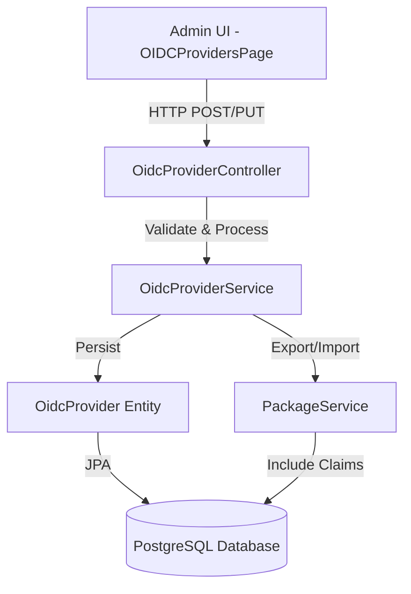

# Design Document: OIDC Claim Mapping

## Overview

This design extends the EMF platform's OIDC provider configuration to support configurable JWT claim mapping. Different OIDC providers (Keycloak, Auth0, Okta, Authentik, etc.) use different claim names in their JWT tokens for the same information. This feature allows administrators to configure how JWT claims are mapped to the EMF platform's internal user attributes.

The implementation spans two repositories:
- **emf-control-plane**: Backend changes (database, entity, service, controller, DTOs)
- **emf-ui**: Frontend changes (React form components)

### Key Design Decisions

1. **Claim Path Format**: Use dot notation for nested claims (e.g., "realm_access.roles")
2. **Role Mapping Storage**: Store as JSON text in database for flexibility
3. **Default Values**: Provide sensible defaults based on common OIDC standards
4. **Backward Compatibility**: Existing providers work with null values by applying defaults at runtime
5. **Validation**: Validate JSON structure for role mappings, validate length for claim paths

## Architecture

### Component Interaction



### Data Flow

1. **Create/Update Flow**:
   - Admin submits form with claim mappings → UI validates JSON
   - UI sends request to controller → Controller validates request DTO
   - Service validates claim paths and role mapping JSON
   - Service persists to database via entity
   - Service publishes OIDC changed event (if Kafka enabled)

2. **Read Flow**:
   - Controller receives GET request
   - Service retrieves entity from database
   - Service applies defaults for null claim fields
   - DTO conversion includes all claim mapping fields
   - Response sent to UI

3. **Package Export/Import Flow**:
   - Export: PackageService includes claim mapping fields in JSON
   - Import: PackageService validates and restores claim mappings

## Components and Interfaces

### Database Schema Changes

**Migration File**: `V6__add_oidc_claim_mapping.sql`

```sql
-- Add claim mapping columns to oidc_provider table
ALTER TABLE oidc_provider
    ADD COLUMN roles_claim VARCHAR(200),
    ADD COLUMN roles_mapping TEXT,
    ADD COLUMN email_claim VARCHAR(200),
    ADD COLUMN username_claim VARCHAR(200),
    ADD COLUMN name_claim VARCHAR(200);

-- Set default values for existing providers
UPDATE oidc_provider
SET 
    email_claim = 'email',
    username_claim = 'preferred_username',
    name_claim = 'name'
WHERE email_claim IS NULL;

-- Add check constraint for roles_mapping JSON validity
ALTER TABLE oidc_provider
    ADD CONSTRAINT chk_oidc_provider_roles_mapping_json
    CHECK (roles_mapping IS NULL OR roles_mapping::jsonb IS NOT NULL);

-- Add comments for documentation
COMMENT ON COLUMN oidc_provider.roles_claim IS 'Path to roles claim in JWT token (e.g., roles, realm_access.roles)';
COMMENT ON COLUMN oidc_provider.roles_mapping IS 'JSON mapping of external role values to internal role names';
COMMENT ON COLUMN oidc_provider.email_claim IS 'Path to email claim in JWT token (default: email)';
COMMENT ON COLUMN oidc_provider.username_claim IS 'Path to username claim in JWT token (default: preferred_username)';
COMMENT ON COLUMN oidc_provider.name_claim IS 'Path to name/display name claim in JWT token (default: name)';
```

### Entity Layer

**File**: `emf-control-plane/app/src/main/java/com/emf/controlplane/entity/OidcProvider.java`

Add new fields to the entity:

```java
@Column(name = "roles_claim", length = 200)
private String rolesClaim;

@Column(name = "roles_mapping", columnDefinition = "TEXT")
private String rolesMapping;

@Column(name = "email_claim", length = 200)
private String emailClaim;

@Column(name = "username_claim", length = 200)
private String usernameClaim;

@Column(name = "name_claim", length = 200)
private String nameClaim;

// Getters and setters
public String getRolesClaim() {
    return rolesClaim;
}

public void setRolesClaim(String rolesClaim) {
    this.rolesClaim = rolesClaim;
}

public String getRolesMapping() {
    return rolesMapping;
}

public void setRolesMapping(String rolesMapping) {
    this.rolesMapping = rolesMapping;
}

public String getEmailClaim() {
    return emailClaim != null ? emailClaim : "email";
}

public void setEmailClaim(String emailClaim) {
    this.emailClaim = emailClaim;
}

public String getUsernameClaim() {
    return usernameClaim != null ? usernameClaim : "preferred_username";
}

public void setUsernameClaim(String usernameClaim) {
    this.usernameClaim = usernameClaim;
}

public String getNameClaim() {
    return nameClaim != null ? nameClaim : "name";
}

public void setNameClaim(String nameClaim) {
    this.nameClaim = nameClaim;
}
```

### DTO Layer

**File**: `emf-control-plane/app/src/main/java/com/emf/controlplane/dto/OidcProviderDto.java`

Add fields and update conversion method:

```java
private String rolesClaim;
private String rolesMapping;
private String emailClaim;
private String usernameClaim;
private String nameClaim;

// Update fromEntity method
public static OidcProviderDto fromEntity(OidcProvider provider) {
    if (provider == null) {
        return null;
    }
    OidcProviderDto dto = new OidcProviderDto(
            provider.getId(),
            provider.getName(),
            provider.getIssuer(),
            provider.getJwksUri(),
            provider.getClientId(),
            provider.getAudience(),
            provider.isActive(),
            provider.getCreatedAt(),
            provider.getUpdatedAt()
    );
    dto.setRolesClaim(provider.getRolesClaim());
    dto.setRolesMapping(provider.getRolesMapping());
    dto.setEmailClaim(provider.getEmailClaim());
    dto.setUsernameClaim(provider.getUsernameClaim());
    dto.setNameClaim(provider.getNameClaim());
    return dto;
}
```

**File**: `emf-control-plane/app/src/main/java/com/emf/controlplane/dto/AddOidcProviderRequest.java`

Add validation annotations:

```java
@Size(max = 200, message = "Roles claim path must not exceed 200 characters")
private String rolesClaim;

@Size(max = 10000, message = "Roles mapping must not exceed 10000 characters")
private String rolesMapping;

@Size(max = 200, message = "Email claim path must not exceed 200 characters")
private String emailClaim;

@Size(max = 200, message = "Username claim path must not exceed 200 characters")
private String usernameClaim;

@Size(max = 200, message = "Name claim path must not exceed 200 characters")
private String nameClaim;
```

**File**: `emf-control-plane/app/src/main/java/com/emf/controlplane/dto/UpdateOidcProviderRequest.java`

Add same fields with validation (all optional for updates).

### Service Layer

**File**: `emf-control-plane/app/src/main/java/com/emf/controlplane/service/OidcProviderService.java`

Add validation method and update create/update methods:

```java
/**
 * Validates roles mapping JSON format.
 * 
 * @param rolesMapping The roles mapping JSON string
 * @throws ValidationException if the JSON is invalid
 */
private void validateRolesMapping(String rolesMapping) {
    if (rolesMapping == null || rolesMapping.isBlank()) {
        return; // null or empty is valid
    }
    
    try {
        // Attempt to parse as JSON to validate format
        new com.fasterxml.jackson.databind.ObjectMapper().readTree(rolesMapping);
    } catch (Exception e) {
        throw new ValidationException("rolesMapping", 
            "Invalid JSON format: " + e.getMessage());
    }
}

/**
 * Validates claim path format.
 * 
 * @param claimPath The claim path to validate
 * @param fieldName The field name for error messages
 * @throws ValidationException if the claim path is invalid
 */
private void validateClaimPath(String claimPath, String fieldName) {
    if (claimPath == null || claimPath.isBlank()) {
        return; // null or empty is valid (will use defaults)
    }
    
    if (claimPath.length() > 200) {
        throw new ValidationException(fieldName, 
            "Claim path must not exceed 200 characters");
    }
    
    // Validate claim path format (alphanumeric, dots, underscores)
    if (!claimPath.matches("^[a-zA-Z0-9_.]+$")) {
        throw new ValidationException(fieldName, 
            "Claim path must contain only letters, numbers, dots, and underscores");
    }
}

// Update addProvider method
public OidcProvider addProvider(AddOidcProviderRequest request) {
    log.info("Adding OIDC provider with name: {}", request.getName());

    // Existing validations...
    validateUrl(request.getIssuer(), "issuer");
    validateUrl(request.getJwksUri(), "jwksUri");
    
    // New validations
    validateClaimPath(request.getRolesClaim(), "rolesClaim");
    validateClaimPath(request.getEmailClaim(), "emailClaim");
    validateClaimPath(request.getUsernameClaim(), "usernameClaim");
    validateClaimPath(request.getNameClaim(), "nameClaim");
    validateRolesMapping(request.getRolesMapping());

    // Check for duplicates...
    
    // Create the provider entity
    OidcProvider provider = new OidcProvider(
            request.getName(),
            request.getIssuer(),
            request.getJwksUri()
    );
    provider.setClientId(request.getClientId());
    provider.setAudience(request.getAudience());
    provider.setRolesClaim(request.getRolesClaim());
    provider.setRolesMapping(request.getRolesMapping());
    provider.setEmailClaim(request.getEmailClaim());
    provider.setUsernameClaim(request.getUsernameClaim());
    provider.setNameClaim(request.getNameClaim());
    provider.setActive(true);

    // Save and publish event...
    provider = providerRepository.save(provider);
    publishOidcChangedEvent();

    log.info("Created OIDC provider with id: {}", provider.getId());
    return provider;
}

// Update updateProvider method similarly
```

### Controller Layer

**File**: `emf-control-plane/app/src/main/java/com/emf/controlplane/controller/OidcProviderController.java`

No changes needed - the controller already handles all fields from the DTOs.

### Package Service Updates

**File**: `emf-control-plane/app/src/main/java/com/emf/controlplane/dto/PackageDto.java`

Update the nested `PackageOidcProviderDto` class:

```java
public static class PackageOidcProviderDto {
    private String name;
    private String issuer;
    private String jwksUri;
    private String clientId;
    private String audience;
    private String rolesClaim;
    private String rolesMapping;
    private String emailClaim;
    private String usernameClaim;
    private String nameClaim;
    
    // Getters, setters, and conversion methods
    
    public static PackageOidcProviderDto fromEntity(OidcProvider provider) {
        PackageOidcProviderDto dto = new PackageOidcProviderDto();
        dto.setName(provider.getName());
        dto.setIssuer(provider.getIssuer());
        dto.setJwksUri(provider.getJwksUri());
        dto.setClientId(provider.getClientId());
        dto.setAudience(provider.getAudience());
        dto.setRolesClaim(provider.getRolesClaim());
        dto.setRolesMapping(provider.getRolesMapping());
        dto.setEmailClaim(provider.getEmailClaim());
        dto.setUsernameClaim(provider.getUsernameClaim());
        dto.setNameClaim(provider.getNameClaim());
        return dto;
    }
}
```

### UI Component Updates

**File**: `emf-ui/app/src/pages/OIDCProvidersPage/OIDCProvidersPage.tsx`

Update the form data interface and add new form fields:

```typescript
interface OIDCProviderFormData {
  name: string;
  issuer: string;
  clientId: string;
  clientSecret: string;
  scopes: string;
  rolesClaim?: string;
  rolesMapping?: string;
  emailClaim?: string;
  usernameClaim?: string;
  nameClaim?: string;
}

// Update validation function
function validateForm(data: OIDCProviderFormData, t: (key: string) => string, isEditing: boolean): FormErrors {
  const errors: FormErrors = {};

  // Existing validations...
  
  // Roles mapping JSON validation
  if (data.rolesMapping && data.rolesMapping.trim()) {
    try {
      JSON.parse(data.rolesMapping);
    } catch {
      errors.rolesMapping = t('oidc.validation.rolesMappingInvalidJson');
    }
  }
  
  // Claim path length validations
  if (data.rolesClaim && data.rolesClaim.length > 200) {
    errors.rolesClaim = t('oidc.validation.claimPathTooLong');
  }
  if (data.emailClaim && data.emailClaim.length > 200) {
    errors.emailClaim = t('oidc.validation.claimPathTooLong');
  }
  if (data.usernameClaim && data.usernameClaim.length > 200) {
    errors.usernameClaim = t('oidc.validation.claimPathTooLong');
  }
  if (data.nameClaim && data.nameClaim.length > 200) {
    errors.nameClaim = t('oidc.validation.claimPathTooLong');
  }

  return errors;
}

// Add new form fields in OIDCProviderForm component
// (After existing fields, before form actions)

{/* Roles Claim Field */}
<div className={styles.formGroup}>
  <label htmlFor="oidc-roles-claim" className={styles.formLabel}>
    {t('oidc.rolesClaim')}
  </label>
  <input
    id="oidc-roles-claim"
    type="text"
    className={`${styles.formInput} ${touched.rolesClaim && errors.rolesClaim ? styles.hasError : ''}`}
    value={formData.rolesClaim || ''}
    onChange={(e) => handleChange('rolesClaim', e.target.value)}
    onBlur={() => handleBlur('rolesClaim')}
    placeholder="roles, realm_access.roles, groups"
    aria-describedby="oidc-roles-claim-hint"
    disabled={isSubmitting}
    data-testid="oidc-roles-claim-input"
  />
  <span id="oidc-roles-claim-hint" className={styles.formHint}>
    {t('oidc.rolesClaimHint')}
  </span>
  {touched.rolesClaim && errors.rolesClaim && (
    <span className={styles.formError} role="alert">
      {errors.rolesClaim}
    </span>
  )}
</div>

{/* Roles Mapping Field */}
<div className={styles.formGroup}>
  <label htmlFor="oidc-roles-mapping" className={styles.formLabel}>
    {t('oidc.rolesMapping')}
  </label>
  <textarea
    id="oidc-roles-mapping"
    className={`${styles.formTextarea} ${touched.rolesMapping && errors.rolesMapping ? styles.hasError : ''}`}
    value={formData.rolesMapping || ''}
    onChange={(e) => handleChange('rolesMapping', e.target.value)}
    onBlur={() => handleBlur('rolesMapping')}
    placeholder='{"external-admin": "ADMIN", "external-user": "USER"}'
    rows={4}
    aria-describedby="oidc-roles-mapping-hint"
    disabled={isSubmitting}
    data-testid="oidc-roles-mapping-input"
  />
  <span id="oidc-roles-mapping-hint" className={styles.formHint}>
    {t('oidc.rolesMappingHint')}
  </span>
  {touched.rolesMapping && errors.rolesMapping && (
    <span className={styles.formError} role="alert">
      {errors.rolesMapping}
    </span>
  )}
</div>

{/* Email Claim Field */}
<div className={styles.formGroup}>
  <label htmlFor="oidc-email-claim" className={styles.formLabel}>
    {t('oidc.emailClaim')}
  </label>
  <input
    id="oidc-email-claim"
    type="text"
    className={`${styles.formInput} ${touched.emailClaim && errors.emailClaim ? styles.hasError : ''}`}
    value={formData.emailClaim || ''}
    onChange={(e) => handleChange('emailClaim', e.target.value)}
    onBlur={() => handleBlur('emailClaim')}
    placeholder="email (default)"
    aria-describedby="oidc-email-claim-hint"
    disabled={isSubmitting}
    data-testid="oidc-email-claim-input"
  />
  <span id="oidc-email-claim-hint" className={styles.formHint}>
    {t('oidc.emailClaimHint')}
  </span>
  {touched.emailClaim && errors.emailClaim && (
    <span className={styles.formError} role="alert">
      {errors.emailClaim}
    </span>
  )}
</div>

{/* Username Claim Field */}
<div className={styles.formGroup}>
  <label htmlFor="oidc-username-claim" className={styles.formLabel}>
    {t('oidc.usernameClaim')}
  </label>
  <input
    id="oidc-username-claim"
    type="text"
    className={`${styles.formInput} ${touched.usernameClaim && errors.usernameClaim ? styles.hasError : ''}`}
    value={formData.usernameClaim || ''}
    onChange={(e) => handleChange('usernameClaim', e.target.value)}
    onBlur={() => handleBlur('usernameClaim')}
    placeholder="preferred_username (default)"
    aria-describedby="oidc-username-claim-hint"
    disabled={isSubmitting}
    data-testid="oidc-username-claim-input"
  />
  <span id="oidc-username-claim-hint" className={styles.formHint}>
    {t('oidc.usernameClaimHint')}
  </span>
  {touched.usernameClaim && errors.usernameClaim && (
    <span className={styles.formError} role="alert">
      {errors.usernameClaim}
    </span>
  )}
</div>

{/* Name Claim Field */}
<div className={styles.formGroup}>
  <label htmlFor="oidc-name-claim" className={styles.formLabel}>
    {t('oidc.nameClaim')}
  </label>
  <input
    id="oidc-name-claim"
    type="text"
    className={`${styles.formInput} ${touched.nameClaim && errors.nameClaim ? styles.hasError : ''}`}
    value={formData.nameClaim || ''}
    onChange={(e) => handleChange('nameClaim', e.target.value)}
    onBlur={() => handleBlur('nameClaim')}
    placeholder="name (default)"
    aria-describedby="oidc-name-claim-hint"
    disabled={isSubmitting}
    data-testid="oidc-name-claim-input"
  />
  <span id="oidc-name-claim-hint" className={styles.formHint}>
    {t('oidc.nameClaimHint')}
  </span>
  {touched.nameClaim && errors.nameClaim && (
    <span className={styles.formError} role="alert">
      {errors.nameClaim}
    </span>
  )}
</div>
```

## Data Models

### OidcProvider Entity

```java
@Entity
@Table(name = "oidc_provider")
public class OidcProvider extends BaseEntity {
    // Existing fields
    private String name;
    private String issuer;
    private String jwksUri;
    private boolean active;
    private String clientId;
    private String audience;
    
    // New claim mapping fields
    private String rolesClaim;        // Path to roles in JWT (e.g., "roles", "realm_access.roles")
    private String rolesMapping;      // JSON mapping of external to internal roles
    private String emailClaim;        // Path to email (default: "email")
    private String usernameClaim;     // Path to username (default: "preferred_username")
    private String nameClaim;         // Path to name (default: "name")
}
```

### Claim Path Examples

Different OIDC providers use different structures:

**Keycloak**:
- Roles: `realm_access.roles` or `resource_access.{client}.roles`
- Email: `email`
- Username: `preferred_username`
- Name: `name`

**Auth0**:
- Roles: `https://myapp.com/roles` (custom namespace)
- Email: `email`
- Username: `nickname` or `sub`
- Name: `name`

**Okta**:
- Roles: `groups`
- Email: `email`
- Username: `preferred_username`
- Name: `name`

**Authentik**:
- Roles: `groups`
- Email: `email`
- Username: `preferred_username`
- Name: `name`

### Role Mapping JSON Structure

```json
{
  "keycloak-admin": "ADMIN",
  "keycloak-user": "USER",
  "external-viewer": "VIEWER"
}
```

This maps external role names from the OIDC provider to internal EMF role names.


## Correctness Properties

*A property is a characteristic or behavior that should hold true across all valid executions of a system—essentially, a formal statement about what the system should do. Properties serve as the bridge between human-readable specifications and machine-verifiable correctness guarantees.*

### Property 1: Default Values Applied for Null Claims

*For any* OIDC provider entity with null claim fields, the getter methods should return the default values: "email" for emailClaim, "preferred_username" for usernameClaim, and "name" for nameClaim.

**Validates: Requirements 2.6, 4.4, 5.4, 8.2**

### Property 2: Entity to DTO Conversion Preserves Claim Fields

*For any* OIDC provider entity, converting it to OidcProviderDto should include all claim mapping fields (rolesClaim, rolesMapping, emailClaim, usernameClaim, nameClaim) with their values preserved.

**Validates: Requirements 3.4**

### Property 3: Claim Path Length Validation

*For any* claim path string, if the length exceeds 200 characters, the validation should reject it with an appropriate error message.

**Validates: Requirements 4.1**

### Property 4: Roles Mapping JSON Validation

*For any* roles_mapping string, if it is non-null and non-empty, it must be valid JSON or the validation should reject it with a descriptive error message indicating the JSON parsing failure.

**Validates: Requirements 4.2, 4.3**

### Property 5: Nested Claim Paths Accepted

*For any* claim path containing dot notation (e.g., "realm_access.roles", "resource_access.client.roles"), the validation should accept it as valid.

**Validates: Requirements 4.5**

### Property 6: POST Request Persists Claim Fields

*For any* valid OIDC provider creation request with claim mapping fields, creating the provider via POST /control/oidc/providers should persist all claim fields and return them in the response.

**Validates: Requirements 5.1**

### Property 7: PUT Request Updates Claim Fields

*For any* existing OIDC provider and valid update request with claim mapping fields, updating the provider via PUT /control/oidc/providers/{id} should persist the updated claim fields and return them in the response.

**Validates: Requirements 5.2**

### Property 8: GET Request Returns Claim Fields

*For any* OIDC provider with claim mapping fields, retrieving it via GET /control/oidc/providers should include all claim mapping fields in the response with their current values or defaults if null.

**Validates: Requirements 5.3, 8.4**

### Property 9: Invalid Claim Configurations Return Errors

*For any* OIDC provider request with invalid claim configurations (invalid JSON in rolesMapping, claim paths exceeding 200 characters, or invalid claim path format), the API should return an appropriate error response with a descriptive message.

**Validates: Requirements 5.5**

### Property 10: UI Form Validates Roles Mapping JSON

*For any* roles_mapping value entered in the UI form, if it is non-empty and not valid JSON, the form validation should reject it and display an error message before submission.

**Validates: Requirements 6.5**

### Property 11: UI Form Populates Existing Provider Data

*For any* existing OIDC provider, when opening the edit form, all claim mapping fields should be populated with the provider's current values.

**Validates: Requirements 6.7**

### Property 12: Package Export Includes Claim Fields

*For any* OIDC provider included in a package export, the exported JSON should contain all claim mapping fields (rolesClaim, rolesMapping, emailClaim, usernameClaim, nameClaim) with their current values.

**Validates: Requirements 9.1**

### Property 13: Package Import Round-Trip Preserves Claims

*For any* OIDC provider, exporting it to a package and then importing that package should restore all claim mapping fields. If claim fields are missing in the import data, default values should be applied.

**Validates: Requirements 9.2, 9.3**

### Property 14: Package Import Validates Claim Configurations

*For any* package import containing OIDC providers with invalid claim configurations, the import should reject the invalid providers and return validation errors.

**Validates: Requirements 9.4**

## Error Handling

### Validation Errors

The system handles validation errors at multiple layers:

1. **Database Layer**: PostgreSQL constraint checks JSON validity for roles_mapping
2. **Service Layer**: Validates claim paths and JSON format before persistence
3. **Controller Layer**: Bean validation annotations on DTOs
4. **UI Layer**: Client-side validation before submission

### Error Response Format

All validation errors follow the standard EMF error response format:

```json
{
  "timestamp": "2024-01-15T10:30:00Z",
  "status": 400,
  "error": "Bad Request",
  "message": "Validation failed",
  "errors": [
    {
      "field": "rolesMapping",
      "message": "Invalid JSON format: Unexpected character at position 15"
    }
  ]
}
```

### Error Scenarios

1. **Invalid JSON in rolesMapping**: Returns 400 with JSON parsing error details
2. **Claim path too long**: Returns 400 with length validation error
3. **Invalid claim path format**: Returns 400 with format validation error
4. **Database constraint violation**: Returns 500 with generic error (JSON constraint)
5. **Package import validation failure**: Returns 400 with list of validation errors

### Backward Compatibility Error Handling

- Null claim fields are handled gracefully with default values
- Existing providers without claim fields continue to work
- Migration failures are logged but don't prevent application startup

## Testing Strategy

### Dual Testing Approach

This feature requires both unit tests and property-based tests for comprehensive coverage:

- **Unit tests**: Verify specific examples, edge cases, and error conditions
- **Property tests**: Verify universal properties across all inputs

### Unit Testing Focus

Unit tests should cover:

1. **Specific Examples**:
   - Migration sets correct defaults for existing providers
   - Default values: email="email", username="preferred_username", name="name"
   - Specific OIDC provider claim path examples (Keycloak, Auth0, Okta)

2. **Edge Cases**:
   - Empty string vs null for claim fields
   - Whitespace-only claim paths
   - Very long claim paths (exactly 200 characters)
   - Empty JSON object "{}" for rolesMapping
   - Null vs missing fields in requests

3. **Integration Points**:
   - Database persistence and retrieval
   - API endpoint request/response handling
   - Package export/import serialization
   - UI form submission and validation

### Property-Based Testing Configuration

- **Library**: Use JUnit 5 with jqwik for Java backend tests
- **Iterations**: Minimum 100 iterations per property test
- **Tag Format**: Each test must reference its design property

Example tag:
```java
/**
 * Feature: oidc-claim-mapping, Property 1: Default Values Applied for Null Claims
 */
@Property
void defaultValuesAppliedForNullClaims(@ForAll OidcProvider provider) {
    // Test implementation
}
```

### Property Test Coverage

Each correctness property (1-14) must be implemented as a property-based test:

1. Property 1: Generate providers with null claims, verify defaults
2. Property 2: Generate entities, verify DTO conversion
3. Property 3: Generate strings of various lengths, verify validation
4. Property 4: Generate valid/invalid JSON, verify validation
5. Property 5: Generate nested claim paths, verify acceptance
6. Property 6: Generate provider requests, verify POST persistence
7. Property 7: Generate update requests, verify PUT persistence
8. Property 8: Generate providers, verify GET response
9. Property 9: Generate invalid configurations, verify errors
10. Property 10: Generate JSON strings, verify UI validation
11. Property 11: Generate providers, verify UI population
12. Property 12: Generate providers, verify export inclusion
13. Property 13: Generate providers, verify round-trip
14. Property 14: Generate invalid packages, verify import rejection

### Test Data Generators

Property tests require custom generators for:

- **Claim paths**: Valid paths with dots, underscores, alphanumeric
- **Invalid claim paths**: Paths with special characters, too long
- **JSON strings**: Valid and invalid JSON for rolesMapping
- **OIDC providers**: Complete provider objects with various claim configurations
- **Package data**: Export/import package structures

### UI Testing

UI tests should cover:

1. **Form Validation**:
   - Roles mapping JSON validation
   - Claim path length validation
   - Error message display

2. **Form Behavior**:
   - Field population for existing providers
   - Default value display
   - Form submission with claim fields

3. **Visual Regression**:
   - Form layout with new fields
   - Error state styling
   - Hint text display

### Testing Tools

- **Backend**: JUnit 5, jqwik (property-based testing), Spring Boot Test, Testcontainers (PostgreSQL)
- **Frontend**: Jest, React Testing Library, MSW (API mocking)
- **Integration**: Playwright or Cypress for end-to-end tests
