# Integration Test Environment Architecture

This document describes the architecture of the EMF integration test environment, including component interactions, data flows, and design decisions.

## Table of Contents

- [Overview](#overview)
- [Architecture Layers](#architecture-layers)
- [Component Diagram](#component-diagram)
- [Service Interactions](#service-interactions)
- [Data Flow](#data-flow)
- [Test Execution Flow](#test-execution-flow)
- [Design Decisions](#design-decisions)
- [Technology Stack](#technology-stack)

## Overview

The integration test environment is a complete, self-contained EMF platform deployment running in Docker containers. It validates the integration between all platform components through automated tests that exercise real request flows.

### Key Characteristics

- **Isolated**: Each test run uses fresh containers and data
- **Reproducible**: Deterministic setup and teardown
- **Comprehensive**: Tests all integration points
- **Fast**: Complete suite runs in < 5 minutes
- **Realistic**: Uses actual services, not mocks

## Architecture Layers

The test environment is organized into four layers:


### Layer 1: Infrastructure Layer

Provides foundational services:

- **PostgreSQL**: Persistent storage for collections and configuration
- **Redis**: Caching and rate limiting
- **Kafka**: Event distribution for configuration updates
- **Keycloak**: OIDC authentication and JWT token issuance

### Layer 2: Platform Services Layer

Core EMF platform services:

- **Control Plane**: Manages collections, authorization policies, and service registry
- **API Gateway**: Routes requests, enforces authentication/authorization, processes JSON:API features

### Layer 3: Sample Service Layer

Test domain service:

- **Sample Service**: Implements projects and tasks collections using emf-platform/runtime-core

### Layer 4: Test Execution Layer

Test orchestration and utilities:

- **Test Framework**: JUnit 5 + jqwik for property-based testing
- **Test Runner**: Orchestrates environment startup and test execution
- **Test Helpers**: Reusable utilities for authentication, test data, and assertions

## Component Diagram


## Service Interactions

### 1. Service Startup Sequence


### 2. Test Request Flow

```mermaid
sequenceDiagram
    participant T as Test
    participant KC as Keycloak
    participant GW as Gateway
    participant SS as Sample Service
    participant PG as PostgreSQL
    participant RD as Redis
    
    T->>KC: POST /token (username, password)
    KC-->>T: JWT token
    
    T->>GW: POST /api/collections/projects<br/>(Authorization: Bearer token)
    GW->>KC: Validate JWT
    KC-->>GW: Token valid, user claims
    GW->>GW: Check authorization policy
    GW->>SS: POST /api/collections/projects
    SS->>SS: Validate request
    SS->>PG: INSERT INTO projects
    PG-->>SS: Project created
    SS->>RD: Cache resource
    SS-->>GW: 201 Created (JSON:API)
    GW->>GW: Apply field filtering
    GW-->>T: 201 Created (JSON:API)
    
    T->>GW: GET /api/collections/projects/{id}?include=tasks
    GW->>KC: Validate JWT
    GW->>SS: GET /api/collections/projects/{id}
    SS->>PG: SELECT FROM projects
    SS->>RD: GET related tasks from cache
    SS-->>GW: 200 OK (with included)
    GW->>GW: Apply field filtering
    GW-->>T: 200 OK (JSON:API)
```



### 3. Configuration Update Flow


## Data Flow

### 1. CRUD Operation Data Flow


### 2. Include Parameter Data Flow


### 3. Event-Driven Configuration Data Flow


## Test Execution Flow

### 1. Test Suite Execution


### 2. Individual Test Execution


### 3. Property-Based Test Execution


## Design Decisions

### 1. Use of EMF Runtime-Core Library

**Decision**: Sample service uses emf-platform/runtime-core instead of custom JPA entities

**Rationale**:
- Demonstrates real-world usage of the platform
- Automatic table creation via `StorageAdapter`
- Automatic REST API via `DynamicCollectionRouter`
- Built-in validation, pagination, sorting, filtering
- Reduces boilerplate code in sample service

**Trade-offs**:
- Adds dependency on runtime-core library
- Requires understanding of collection definition API
- Less flexibility for custom business logic

### 2. Redis for Include Processing

**Decision**: Cache resources in Redis for JSON:API include parameter processing

**Rationale**:
- Fast retrieval of related resources
- Reduces database queries
- Demonstrates caching patterns
- Tests cache invalidation logic

**Trade-offs**:
- Adds Redis dependency
- Requires cache consistency management
- Cache misses must be handled gracefully

### 3. Kafka for Configuration Updates

**Decision**: Use Kafka events for dynamic configuration updates

**Rationale**:
- Enables zero-downtime configuration changes
- Decouples control plane from gateway
- Demonstrates event-driven architecture
- Tests eventual consistency

**Trade-offs**:
- Adds Kafka dependency
- Requires event schema management
- Eventual consistency complexity

### 4. Dual Testing Approach

**Decision**: Use both unit tests and property-based tests

**Rationale**:
- Unit tests validate specific scenarios
- Property tests validate universal properties
- Comprehensive coverage with different approaches
- Demonstrates testing best practices

**Trade-offs**:
- More tests to maintain
- Longer test execution time
- Requires understanding of property-based testing

### 5. Docker Compose for Orchestration

**Decision**: Use Docker Compose instead of Testcontainers

**Rationale**:
- Simpler setup for developers
- Easier to debug (can inspect running containers)
- Reusable for local development
- Matches production deployment patterns

**Trade-offs**:
- Less programmatic control
- Requires Docker Compose installation
- Harder to parallelize tests

### 6. Keycloak for Authentication

**Decision**: Use Keycloak instead of mock authentication

**Rationale**:
- Tests real OIDC flows
- Validates JWT token handling
- Demonstrates production authentication
- Tests token expiration and refresh

**Trade-offs**:
- Slower startup time
- More complex configuration
- Additional resource usage

## Technology Stack

### Infrastructure

| Component | Technology | Version | Purpose |
|-----------|-----------|---------|---------|
| Database | PostgreSQL | 15 | Persistent storage |
| Cache | Redis | 7 | Caching and rate limiting |
| Message Broker | Kafka | 3.6 (KRaft) | Event distribution |
| Identity Provider | Keycloak | 23 | OIDC authentication |

### Platform Services

| Component | Technology | Version | Purpose |
|-----------|-----------|---------|---------|
| Control Plane | Spring Boot | 3.2 | Configuration management |
| API Gateway | Spring Cloud Gateway | 4.1 | Request routing |
| Sample Service | Spring Boot | 3.2 | Test domain service |

### Testing Framework

| Component | Technology | Version | Purpose |
|-----------|-----------|---------|---------|
| Test Framework | JUnit 5 | 5.10 | Test execution |
| Property Testing | jqwik | 1.8 | Property-based tests |
| HTTP Client | RestTemplate | (Spring) | API requests |
| Assertions | AssertJ | 3.24 | Fluent assertions |
| Async Testing | Awaitility | 4.2 | Waiting for conditions |

### Build and Deployment

| Component | Technology | Version | Purpose |
|-----------|-----------|---------|---------|
| Build Tool | Maven | 3.9 | Dependency management |
| Container Runtime | Docker | 20.10+ | Container execution |
| Orchestration | Docker Compose | 2.0+ | Multi-container apps |
| Java Runtime | Eclipse Temurin | 21 | JVM |

## Network Architecture


### Port Mapping

| Service | Internal Port | External Port | Purpose |
|---------|--------------|---------------|---------|
| API Gateway | 8080 | 8080 | Main API endpoint |
| Control Plane | 8080 | 8081 | Management API |
| Sample Service | 8080 | 8082 | Test service API |
| PostgreSQL | 5432 | 5432 | Database access |
| Redis | 6379 | 6379 | Cache access |
| Kafka | 9092 | 9092 | Event streaming |
| Keycloak | 8080 | 8180 | Authentication |

## Security Architecture

### Authentication Flow


### Authorization Model


## Scalability Considerations

### Current Limitations

- Single instance of each service
- No load balancing
- No horizontal scaling
- Limited to local development

### Production Differences

| Aspect | Test Environment | Production |
|--------|-----------------|------------|
| Instances | Single | Multiple replicas |
| Load Balancing | None | Kubernetes Service |
| Database | Single PostgreSQL | Clustered database |
| Cache | Single Redis | Redis Cluster |
| Message Broker | Single Kafka | Kafka Cluster |
| Persistence | Docker volumes | Persistent volumes |
| Networking | Docker network | Kubernetes network |

## Monitoring and Observability

### Health Checks

All services expose Spring Boot Actuator health endpoints:

```
GET /actuator/health
```

Response:
```json
{
  "status": "UP",
  "components": {
    "db": {"status": "UP"},
    "redis": {"status": "UP"},
    "kafka": {"status": "UP"}
  }
}
```

### Logging

Services log to stdout/stderr, collected by Docker:

```bash
# View logs
docker-compose logs <service-name>

# Follow logs
docker-compose logs -f <service-name>

# View all logs
docker-compose logs
```

### Metrics

Spring Boot Actuator provides metrics:

```
GET /actuator/metrics
GET /actuator/metrics/{metric-name}
```

## Future Enhancements

### Planned Improvements

1. **Testcontainers Integration**: Programmatic container management
2. **Parallel Test Execution**: Run tests concurrently
3. **Performance Testing**: Load and stress tests
4. **Chaos Engineering**: Failure injection tests
5. **Contract Testing**: API contract validation
6. **Mutation Testing**: Test quality validation
7. **Visual Regression**: UI component testing
8. **Distributed Tracing**: Request flow visualization

### Potential Optimizations

1. **Container Caching**: Reuse containers between test runs
2. **Incremental Testing**: Run only affected tests
3. **Test Sharding**: Distribute tests across runners
4. **Resource Pooling**: Share infrastructure services
5. **Snapshot Testing**: Faster database initialization

## References

- [EMF Platform Documentation](emf-docs/)
- [Spring Boot Documentation](https://spring.io/projects/spring-boot)
- [Docker Compose Documentation](https://docs.docker.com/compose/)
- [JUnit 5 Documentation](https://junit.org/junit5/)
- [jqwik Documentation](https://jqwik.net/)
- [JSON:API Specification](https://jsonapi.org/)
