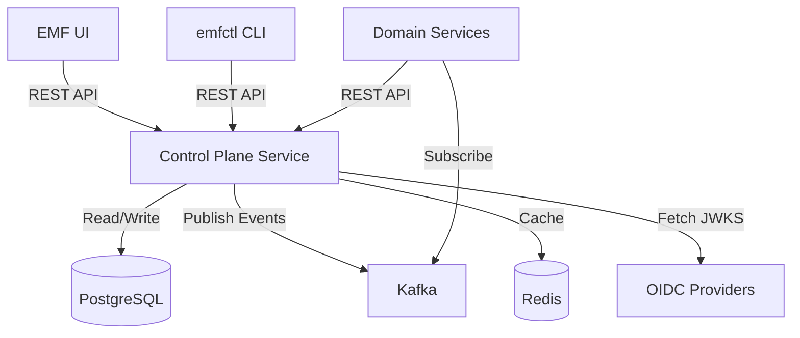
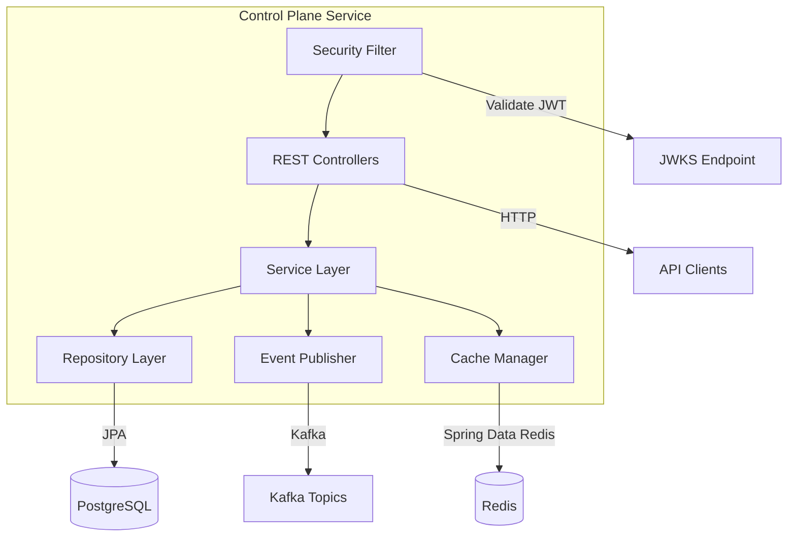

# Design Document: Control Plane Service

## Overview

The Control Plane Service is a Spring Boot application that provides REST APIs for managing all runtime configuration in the EMF platform. It serves as the central source of truth for collection definitions, authorization policies, UI configuration, OIDC providers, packages, and schema migrations.

The service follows a layered architecture with clear separation between REST controllers, service layer business logic, data access layer, and event publishing. All configuration changes are persisted to PostgreSQL and published to Kafka for consumption by domain services.

### Key Design Principles

1. **Versioned Schema Evolution**: All collection schema changes create new immutable versions, enabling rollback and historical tracking
2. **Event-Driven Updates**: Configuration changes are published to Kafka so domain services can react without restart
3. **API-First Design**: OpenAPI specification is dynamically generated from runtime configuration
4. **Security by Default**: All endpoints require JWT authentication with role-based authorization
5. **Observability**: Comprehensive logging, metrics, and tracing for production operations

## Architecture

### High-Level Architecture



### Component Architecture



### Technology Stack

- **Framework**: Spring Boot 3.2+
- **Language**: Java 21+
- **Database**: PostgreSQL 15+ (via Spring Data JPA)
- **Messaging**: Apache Kafka (via Spring Kafka)
- **Caching**: Redis (via Spring Data Redis)
- **Security**: Spring Security (OAuth2 Resource Server)
- **API Documentation**: springdoc-openapi 2.x
- **Observability**: Spring Actuator, Micrometer, OpenTelemetry
- **Build**: Maven
- **Dependencies**: emf-platform runtime-core library

## Components and Interfaces

### 1. REST Controllers

#### CollectionController
Handles collection management endpoints.

```java
@RestController
@RequestMapping("/control/collections")
@SecurityRequirement(name = "bearer-jwt")
public class CollectionController {
    
    @GetMapping
    public Page<CollectionDto> listCollections(
        @RequestParam(required = false) String filter,
        @RequestParam(required = false) String sort,
        Pageable pageable
    );
    
    @PostMapping
    @PreAuthorize("hasRole('ADMIN')")
    public CollectionDto createCollection(@Valid @RequestBody CreateCollectionRequest request);
    
    @GetMapping("/{id}")
    public CollectionDto getCollection(@PathVariable String id);
    
    @PutMapping("/{id}")
    @PreAuthorize("hasRole('ADMIN')")
    public CollectionDto updateCollection(
        @PathVariable String id,
        @Valid @RequestBody UpdateCollectionRequest request
    );
    
    @DeleteMapping("/{id}")
    @PreAuthorize("hasRole('ADMIN')")
    public void deleteCollection(@PathVariable String id);
    
    @GetMapping("/{id}/fields")
    public List<FieldDto> listFields(@PathVariable String id);
    
    @PostMapping("/{id}/fields")
    @PreAuthorize("hasRole('ADMIN')")
    public FieldDto addField(
        @PathVariable String id,
        @Valid @RequestBody AddFieldRequest request
    );
    
    @PutMapping("/{id}/fields/{fieldId}")
    @PreAuthorize("hasRole('ADMIN')")
    public FieldDto updateField(
        @PathVariable String id,
        @PathVariable String fieldId,
        @Valid @RequestBody UpdateFieldRequest request
    );
    
    @DeleteMapping("/{id}/fields/{fieldId}")
    @PreAuthorize("hasRole('ADMIN')")
    public void deleteField(@PathVariable String id, @PathVariable String fieldId);
}
```

#### AuthorizationController
Handles authorization management endpoints.

```java
@RestController
@RequestMapping("/control")
@SecurityRequirement(name = "bearer-jwt")
public class AuthorizationController {
    
    @GetMapping("/roles")
    @PreAuthorize("hasRole('ADMIN')")
    public List<RoleDto> listRoles();
    
    @PostMapping("/roles")
    @PreAuthorize("hasRole('ADMIN')")
    public RoleDto createRole(@Valid @RequestBody CreateRoleRequest request);
    
    @GetMapping("/policies")
    @PreAuthorize("hasRole('ADMIN')")
    public List<PolicyDto> listPolicies();
    
    @PostMapping("/policies")
    @PreAuthorize("hasRole('ADMIN')")
    public PolicyDto createPolicy(@Valid @RequestBody CreatePolicyRequest request);
    
    @PutMapping("/collections/{id}/authz")
    @PreAuthorize("hasRole('ADMIN')")
    public AuthorizationConfigDto setCollectionAuthorization(
        @PathVariable String id,
        @Valid @RequestBody SetAuthorizationRequest request
    );
}
```

#### OidcProviderController
Handles OIDC provider management endpoints.

```java
@RestController
@RequestMapping("/control/oidc/providers")
@SecurityRequirement(name = "bearer-jwt")
public class OidcProviderController {
    
    @GetMapping
    @PreAuthorize("hasRole('ADMIN')")
    public List<OidcProviderDto> listProviders();
    
    @PostMapping
    @PreAuthorize("hasRole('ADMIN')")
    public OidcProviderDto addProvider(@Valid @RequestBody AddOidcProviderRequest request);
    
    @PutMapping("/{id}")
    @PreAuthorize("hasRole('ADMIN')")
    public OidcProviderDto updateProvider(
        @PathVariable String id,
        @Valid @RequestBody UpdateOidcProviderRequest request
    );
    
    @DeleteMapping("/{id}")
    @PreAuthorize("hasRole('ADMIN')")
    public void deleteProvider(@PathVariable String id);
}
```

#### UiConfigController
Handles UI configuration endpoints.

```java
@RestController
@RequestMapping("/ui")
@SecurityRequirement(name = "bearer-jwt")
public class UiConfigController {
    
    @GetMapping("/config/bootstrap")
    public BootstrapConfigDto getBootstrapConfig();
    
    @GetMapping("/pages")
    @PreAuthorize("hasRole('ADMIN')")
    public List<UiPageDto> listPages();
    
    @PostMapping("/pages")
    @PreAuthorize("hasRole('ADMIN')")
    public UiPageDto createPage(@Valid @RequestBody CreatePageRequest request);
    
    @PutMapping("/pages/{id}")
    @PreAuthorize("hasRole('ADMIN')")
    public UiPageDto updatePage(
        @PathVariable String id,
        @Valid @RequestBody UpdatePageRequest request
    );
    
    @GetMapping("/menus")
    @PreAuthorize("hasRole('ADMIN')")
    public List<UiMenuDto> listMenus();
    
    @PutMapping("/menus/{id}")
    @PreAuthorize("hasRole('ADMIN')")
    public UiMenuDto updateMenu(
        @PathVariable String id,
        @Valid @RequestBody UpdateMenuRequest request
    );
}
```

#### PackageController
Handles package import/export endpoints.

```java
@RestController
@RequestMapping("/control/packages")
@SecurityRequirement(name = "bearer-jwt")
public class PackageController {
    
    @PostMapping("/export")
    @PreAuthorize("hasRole('ADMIN')")
    public PackageDto exportPackage(@Valid @RequestBody ExportPackageRequest request);
    
    @PostMapping("/import")
    @PreAuthorize("hasRole('ADMIN')")
    public ImportResultDto importPackage(
        @Valid @RequestBody ImportPackageRequest request,
        @RequestParam(defaultValue = "false") boolean dryRun
    );
}
```

#### MigrationController
Handles migration management endpoints.

```java
@RestController
@RequestMapping("/control/migrations")
@SecurityRequirement(name = "bearer-jwt")
public class MigrationController {
    
    @PostMapping("/plan")
    @PreAuthorize("hasRole('ADMIN')")
    public MigrationPlanDto planMigration(@Valid @RequestBody PlanMigrationRequest request);
    
    @GetMapping("/runs")
    @PreAuthorize("hasRole('ADMIN')")
    public List<MigrationRunDto> listMigrationRuns();
    
    @GetMapping("/runs/{id}")
    @PreAuthorize("hasRole('ADMIN')")
    public MigrationRunDto getMigrationRun(@PathVariable String id);
}
```

#### DiscoveryController
Handles resource discovery endpoint.

```java
@RestController
@RequestMapping("/api/_meta")
@SecurityRequirement(name = "bearer-jwt")
public class DiscoveryController {
    
    @GetMapping("/resources")
    public ResourceDiscoveryDto discoverResources();
}
```

### 2. Service Layer

#### CollectionService
Business logic for collection management.

```java
@Service
public class CollectionService {
    
    private final CollectionRepository collectionRepository;
    private final CollectionVersionRepository versionRepository;
    private final FieldRepository fieldRepository;
    private final ConfigEventPublisher eventPublisher;
    private final CacheManager cacheManager;
    
    @Transactional(readOnly = true)
    public Page<Collection> listCollections(String filter, String sort, Pageable pageable);
    
    @Transactional
    public Collection createCollection(CreateCollectionRequest request);
    
    @Transactional(readOnly = true)
    public Collection getCollection(String id);
    
    @Transactional
    public Collection updateCollection(String id, UpdateCollectionRequest request);
    
    @Transactional
    public void deleteCollection(String id);
    
    @Transactional(readOnly = true)
    public List<Field> listFields(String collectionId);
    
    @Transactional
    public Field addField(String collectionId, AddFieldRequest request);
    
    @Transactional
    public Field updateField(String collectionId, String fieldId, UpdateFieldRequest request);
    
    @Transactional
    public void deleteField(String collectionId, String fieldId);
    
    private void createNewVersion(Collection collection);
    
    private void publishCollectionChangedEvent(Collection collection);
    
    private void invalidateCache(String collectionId);
}
```

#### AuthorizationService
Business logic for authorization management.

```java
@Service
public class AuthorizationService {
    
    private final RoleRepository roleRepository;
    private final PolicyRepository policyRepository;
    private final RoutePolicyRepository routePolicyRepository;
    private final FieldPolicyRepository fieldPolicyRepository;
    private final ConfigEventPublisher eventPublisher;
    
    @Transactional(readOnly = true)
    public List<Role> listRoles();
    
    @Transactional
    public Role createRole(CreateRoleRequest request);
    
    @Transactional(readOnly = true)
    public List<Policy> listPolicies();
    
    @Transactional
    public Policy createPolicy(CreatePolicyRequest request);
    
    @Transactional
    public AuthorizationConfig setCollectionAuthorization(String collectionId, SetAuthorizationRequest request);
    
    private void publishAuthzChangedEvent(String collectionId);
}
```

#### OidcProviderService
Business logic for OIDC provider management.

```java
@Service
public class OidcProviderService {
    
    private final OidcProviderRepository providerRepository;
    private final ConfigEventPublisher eventPublisher;
    private final JwksCache jwksCache;
    
    @Transactional(readOnly = true)
    public List<OidcProvider> listProviders();
    
    @Transactional
    public OidcProvider addProvider(AddOidcProviderRequest request);
    
    @Transactional
    public OidcProvider updateProvider(String id, UpdateOidcProviderRequest request);
    
    @Transactional
    public void deleteProvider(String id);
    
    private void publishOidcChangedEvent();
    
    private void invalidateJwksCache(String providerId);
}
```

#### UiConfigService
Business logic for UI configuration management.

```java
@Service
public class UiConfigService {
    
    private final UiPageRepository pageRepository;
    private final UiMenuRepository menuRepository;
    private final ConfigEventPublisher eventPublisher;
    
    @Transactional(readOnly = true)
    public BootstrapConfig getBootstrapConfig();
    
    @Transactional(readOnly = true)
    public List<UiPage> listPages();
    
    @Transactional
    public UiPage createPage(CreatePageRequest request);
    
    @Transactional
    public UiPage updatePage(String id, UpdatePageRequest request);
    
    @Transactional(readOnly = true)
    public List<UiMenu> listMenus();
    
    @Transactional
    public UiMenu updateMenu(String id, UpdateMenuRequest request);
    
    private void publishUiChangedEvent();
}
```

#### PackageService
Business logic for package import/export.

```java
@Service
public class PackageService {
    
    private final PackageRepository packageRepository;
    private final CollectionService collectionService;
    private final AuthorizationService authorizationService;
    private final UiConfigService uiConfigService;
    
    @Transactional
    public Package exportPackage(ExportPackageRequest request);
    
    @Transactional
    public ImportResult importPackage(ImportPackageRequest request, boolean dryRun);
    
    private void validatePackage(Package pkg);
    
    private ImportResult previewImport(Package pkg);
    
    private ImportResult applyImport(Package pkg);
}
```

#### MigrationService
Business logic for migration management.

```java
@Service
public class MigrationService {
    
    private final MigrationRunRepository migrationRunRepository;
    private final CollectionService collectionService;
    
    @Transactional
    public MigrationPlan planMigration(PlanMigrationRequest request);
    
    @Transactional(readOnly = true)
    public List<MigrationRun> listMigrationRuns();
    
    @Transactional(readOnly = true)
    public MigrationRun getMigrationRun(String id);
    
    private List<MigrationStep> generateSteps(Collection current, Collection target);
}
```

#### DiscoveryService
Business logic for resource discovery.

```java
@Service
public class DiscoveryService {
    
    private final CollectionService collectionService;
    private final AuthorizationService authorizationService;
    
    @Transactional(readOnly = true)
    public ResourceDiscovery discoverResources();
    
    private ResourceMetadata buildResourceMetadata(Collection collection);
}
```

### 3. Event Publishing

#### ConfigEventPublisher
Publishes configuration change events to Kafka.

```java
@Component
public class ConfigEventPublisher {
    
    private final KafkaTemplate<String, ConfigEvent> kafkaTemplate;
    
    public void publishCollectionChanged(Collection collection);
    
    public void publishAuthzChanged(String collectionId);
    
    public void publishUiChanged();
    
    public void publishOidcChanged();
    
    private ConfigEvent buildEvent(String eventType, Object payload);
}
```

### 4. Security Configuration

#### SecurityConfig
Configures Spring Security for JWT authentication.

```java
@Configuration
@EnableWebSecurity
@EnableMethodSecurity
public class SecurityConfig {
    
    @Bean
    public SecurityFilterChain filterChain(HttpSecurity http) throws Exception {
        http
            .authorizeHttpRequests(authz -> authz
                .requestMatchers("/actuator/health/**").permitAll()
                .requestMatchers("/openapi.json", "/openapi.yaml").permitAll()
                .anyRequest().authenticated()
            )
            .oauth2ResourceServer(oauth2 -> oauth2
                .jwt(jwt -> jwt.jwtAuthenticationConverter(jwtAuthenticationConverter()))
            );
        return http.build();
    }
    
    @Bean
    public JwtAuthenticationConverter jwtAuthenticationConverter();
}
```

#### JwksCache
Caches JWKS keys from OIDC providers.

```java
@Component
public class JwksCache {
    
    private final RedisTemplate<String, JwkSet> redisTemplate;
    private final OidcProviderRepository providerRepository;
    private final WebClient webClient;
    
    @Cacheable(value = "jwks", key = "#providerId")
    public JwkSet getJwkSet(String providerId);
    
    @CacheEvict(value = "jwks", key = "#providerId")
    public void invalidate(String providerId);
    
    private JwkSet fetchJwkSet(String jwksUri);
}
```

### 5. OpenAPI Generation

#### OpenApiCustomizer
Customizes the generated OpenAPI specification.

```java
@Component
public class OpenApiCustomizer implements OpenApiCustomiser {
    
    private final CollectionService collectionService;
    
    @Override
    public void customise(OpenAPI openApi) {
        // Add dynamically generated paths for runtime collections
        List<Collection> collections = collectionService.listCollections(null, null, Pageable.unpaged()).getContent();
        for (Collection collection : collections) {
            addCollectionPaths(openApi, collection);
        }
    }
    
    private void addCollectionPaths(OpenAPI openApi, Collection collection);
}
```

### 6. Observability

#### LoggingFilter
Adds correlation IDs to all requests.

```java
@Component
@Order(Ordered.HIGHEST_PRECEDENCE)
public class LoggingFilter extends OncePerRequestFilter {
    
    @Override
    protected void doFilterInternal(
        HttpServletRequest request,
        HttpServletResponse response,
        FilterChain filterChain
    ) throws ServletException, IOException {
        String requestId = UUID.randomUUID().toString();
        MDC.put("requestId", requestId);
        MDC.put("traceId", getTraceId());
        MDC.put("spanId", getSpanId());
        
        try {
            filterChain.doFilter(request, response);
        } finally {
            MDC.clear();
        }
    }
}
```

#### MetricsConfig
Configures custom metrics.

```java
@Configuration
public class MetricsConfig {
    
    @Bean
    public MeterRegistryCustomizer<MeterRegistry> metricsCommonTags() {
        return registry -> registry.config()
            .commonTags("application", "control-plane-service");
    }
}
```

## Data Models

### Domain Entities

#### Collection
```java
@Entity
@Table(name = "collection")
public class Collection {
    @Id
    private String id;
    
    private String name;
    private String description;
    private boolean active;
    
    @OneToMany(mappedBy = "collection", cascade = CascadeType.ALL)
    private List<Field> fields;
    
    @OneToMany(mappedBy = "collection", cascade = CascadeType.ALL)
    private List<CollectionVersion> versions;
    
    private Integer currentVersion;
    
    @CreatedDate
    private Instant createdAt;
    
    @LastModifiedDate
    private Instant updatedAt;
}
```

#### Field
```java
@Entity
@Table(name = "field")
public class Field {
    @Id
    private String id;
    
    @ManyToOne
    @JoinColumn(name = "collection_id")
    private Collection collection;
    
    private String name;
    private String type;
    private boolean required;
    private boolean active;
    
    @Column(columnDefinition = "jsonb")
    private String constraints;
    
    @CreatedDate
    private Instant createdAt;
    
    @LastModifiedDate
    private Instant updatedAt;
}
```

#### CollectionVersion
```java
@Entity
@Table(name = "collection_version")
public class CollectionVersion {
    @Id
    private String id;
    
    @ManyToOne
    @JoinColumn(name = "collection_id")
    private Collection collection;
    
    private Integer version;
    
    @Column(columnDefinition = "jsonb")
    private String schema;
    
    @CreatedDate
    private Instant createdAt;
}
```

#### Role
```java
@Entity
@Table(name = "role")
public class Role {
    @Id
    private String id;
    
    private String name;
    private String description;
    
    @CreatedDate
    private Instant createdAt;
}
```

#### Policy
```java
@Entity
@Table(name = "policy")
public class Policy {
    @Id
    private String id;
    
    private String name;
    private String description;
    
    @Column(columnDefinition = "jsonb")
    private String rules;
    
    @CreatedDate
    private Instant createdAt;
}
```

#### RoutePolicy
```java
@Entity
@Table(name = "route_policy")
public class RoutePolicy {
    @Id
    private String id;
    
    @ManyToOne
    @JoinColumn(name = "collection_id")
    private Collection collection;
    
    private String operation;
    
    @ManyToOne
    @JoinColumn(name = "policy_id")
    private Policy policy;
    
    @CreatedDate
    private Instant createdAt;
}
```

#### FieldPolicy
```java
@Entity
@Table(name = "field_policy")
public class FieldPolicy {
    @Id
    private String id;
    
    @ManyToOne
    @JoinColumn(name = "field_id")
    private Field field;
    
    private String operation;
    
    @ManyToOne
    @JoinColumn(name = "policy_id")
    private Policy policy;
    
    @CreatedDate
    private Instant createdAt;
}
```

#### OidcProvider
```java
@Entity
@Table(name = "oidc_provider")
public class OidcProvider {
    @Id
    private String id;
    
    private String name;
    private String issuer;
    private String jwksUri;
    private boolean active;
    
    @CreatedDate
    private Instant createdAt;
    
    @LastModifiedDate
    private Instant updatedAt;
}
```

#### UiPage
```java
@Entity
@Table(name = "ui_page")
public class UiPage {
    @Id
    private String id;
    
    private String name;
    private String path;
    
    @Column(columnDefinition = "jsonb")
    private String config;
    
    @CreatedDate
    private Instant createdAt;
    
    @LastModifiedDate
    private Instant updatedAt;
}
```

#### UiMenu
```java
@Entity
@Table(name = "ui_menu")
public class UiMenu {
    @Id
    private String id;
    
    private String name;
    
    @OneToMany(mappedBy = "menu", cascade = CascadeType.ALL)
    private List<UiMenuItem> items;
    
    @CreatedDate
    private Instant createdAt;
    
    @LastModifiedDate
    private Instant updatedAt;
}
```

#### UiMenuItem
```java
@Entity
@Table(name = "ui_menu_item")
public class UiMenuItem {
    @Id
    private String id;
    
    @ManyToOne
    @JoinColumn(name = "menu_id")
    private UiMenu menu;
    
    private String label;
    private String path;
    private Integer order;
    
    @CreatedDate
    private Instant createdAt;
}
```

#### Package
```java
@Entity
@Table(name = "package")
public class Package {
    @Id
    private String id;
    
    private String name;
    private String version;
    
    @OneToMany(mappedBy = "package", cascade = CascadeType.ALL)
    private List<PackageItem> items;
    
    @CreatedDate
    private Instant createdAt;
}
```

#### PackageItem
```java
@Entity
@Table(name = "package_item")
public class PackageItem {
    @Id
    private String id;
    
    @ManyToOne
    @JoinColumn(name = "package_id")
    private Package package;
    
    private String itemType;
    private String itemId;
    
    @Column(columnDefinition = "jsonb")
    private String content;
    
    @CreatedDate
    private Instant createdAt;
}
```

#### MigrationRun
```java
@Entity
@Table(name = "migration_run")
public class MigrationRun {
    @Id
    private String id;
    
    private String collectionId;
    private Integer fromVersion;
    private Integer toVersion;
    private String status;
    
    @OneToMany(mappedBy = "migrationRun", cascade = CascadeType.ALL)
    private List<MigrationStep> steps;
    
    @CreatedDate
    private Instant createdAt;
    
    @LastModifiedDate
    private Instant updatedAt;
}
```

#### MigrationStep
```java
@Entity
@Table(name = "migration_step")
public class MigrationStep {
    @Id
    private String id;
    
    @ManyToOne
    @JoinColumn(name = "migration_run_id")
    private MigrationRun migrationRun;
    
    private Integer stepNumber;
    private String operation;
    private String status;
    
    @Column(columnDefinition = "jsonb")
    private String details;
    
    @CreatedDate
    private Instant createdAt;
    
    @LastModifiedDate
    private Instant updatedAt;
}
```

### DTOs

DTOs are used for API request/response serialization. Each entity has corresponding DTOs for different operations (e.g., CreateCollectionRequest, UpdateCollectionRequest, CollectionDto).

### Event Models

#### ConfigEvent
```java
public class ConfigEvent {
    private String eventId;
    private String eventType;
    private String correlationId;
    private Instant timestamp;
    private Object payload;
}
```


## Correctness Properties

A property is a characteristic or behavior that should hold true across all valid executions of a system—essentially, a formal statement about what the system should do. Properties serve as the bridge between human-readable specifications and machine-verifiable correctness guarantees.

### Property Reflection

After analyzing all acceptance criteria, I identified several redundant properties that can be consolidated:

- Event publishing properties (1.8, 2.6, 3.7, 4.6, 5.7) are duplicated in requirement 10 (10.1-10.4). We'll keep the requirement 10 versions as they're more comprehensive.
- JWKS caching (4.7, 12.5, 14.2) is stated three times. We'll keep one comprehensive property.
- Versioning on field changes (2.2, 2.4, 2.5) is duplicated in 15.3. We'll keep the specific field operation properties.
- Collection update versioning (1.6) is duplicated in 15.2. We'll keep the more specific 15.2.
- Persistence requirements (11.1-11.18) are implementation details covered by CRUD operation properties.

### Core CRUD Properties

**Property 1: Collection creation persistence**
*For any* valid collection creation request, creating the collection should result in a persisted collection with a generated ID that can be retrieved by that ID.
**Validates: Requirements 1.2, 1.4**

**Property 2: Collection creation validation**
*For any* invalid collection creation request, the system should reject the request and return validation errors without persisting any data.
**Validates: Requirements 1.3**

**Property 3: Collection listing with pagination**
*For any* set of collections and pagination parameters, the list endpoint should return results that respect the page size and offset, and the total count should match the actual number of collections.
**Validates: Requirements 1.1**

**Property 4: Collection filtering**
*For any* set of collections and filter criteria, the list endpoint should return only collections that match the filter criteria.
**Validates: Requirements 1.1**

**Property 5: Collection sorting**
*For any* set of collections and sort criteria, the list endpoint should return collections ordered according to the sort criteria.
**Validates: Requirements 1.1**

**Property 6: Collection soft deletion**
*For any* existing collection, deleting it should mark it as inactive rather than removing it from the database, and it should no longer appear in active collection lists.
**Validates: Requirements 1.7**

**Property 7: Field creation persistence**
*For any* valid field addition request to an existing collection, the field should be persisted and appear in the collection's field list.
**Validates: Requirements 2.1, 2.2**

**Property 8: Field creation validation**
*For any* invalid field addition request (invalid type or constraints), the system should reject the request and return validation errors without persisting any data.
**Validates: Requirements 2.3**

**Property 9: Active fields only in listing**
*For any* collection, listing its fields should return only fields marked as active, excluding any inactive fields.
**Validates: Requirements 2.1**

**Property 10: Role creation persistence**
*For any* valid role creation request, the role should be persisted and appear in the roles list.
**Validates: Requirements 3.1, 3.2**

**Property 11: Policy creation persistence**
*For any* valid policy creation request, the policy should be persisted and appear in the policies list.
**Validates: Requirements 3.3, 3.4**

**Property 12: Route authorization persistence**
*For any* collection and route authorization configuration, setting the route authorization should persist the route policies and they should be retrievable.
**Validates: Requirements 3.5**

**Property 13: Field authorization persistence**
*For any* collection and field authorization configuration, setting the field authorization should persist the field policies and they should be retrievable.
**Validates: Requirements 3.6**

**Property 14: OIDC provider creation persistence**
*For any* valid OIDC provider configuration, adding the provider should persist it and it should appear in the providers list.
**Validates: Requirements 4.1, 4.2**

**Property 15: OIDC provider validation**
*For any* invalid OIDC provider configuration, the system should reject the request and return validation errors without persisting any data.
**Validates: Requirements 4.3**

**Property 16: OIDC provider update persistence**
*For any* existing OIDC provider and valid update request, updating the provider should persist the changes and they should be reflected in subsequent retrievals.
**Validates: Requirements 4.4**

**Property 17: OIDC provider soft deletion**
*For any* existing OIDC provider, deleting it should mark it as inactive rather than removing it from the database.
**Validates: Requirements 4.5**

**Property 18: UI page creation persistence**
*For any* valid UI page creation request, the page should be persisted and appear in the pages list.
**Validates: Requirements 5.2, 5.3**

**Property 19: UI page update persistence**
*For any* existing UI page and valid update request, updating the page should persist the changes and they should be reflected in subsequent retrievals.
**Validates: Requirements 5.4**

**Property 20: UI menu update persistence**
*For any* existing UI menu and valid update request, updating the menu should persist the changes and they should be reflected in subsequent retrievals.
**Validates: Requirements 5.5, 5.6**

### Event Publishing Properties

**Property 21: Collection change events**
*For any* collection creation, update, or deletion operation, the system should publish a config.collection.changed event to Kafka containing the full collection entity and a correlation ID.
**Validates: Requirements 10.1, 10.5, 10.6**

**Property 22: Authorization change events**
*For any* authorization configuration change (role, policy, route policy, or field policy), the system should publish a config.authz.changed event to Kafka containing the full changed entity and a correlation ID.
**Validates: Requirements 10.2, 10.5, 10.6**

**Property 23: UI configuration change events**
*For any* UI configuration change (page or menu), the system should publish a config.ui.changed event to Kafka containing the full changed entity and a correlation ID.
**Validates: Requirements 10.3, 10.5, 10.6**

**Property 24: OIDC configuration change events**
*For any* OIDC provider configuration change, the system should publish a config.oidc.changed event to Kafka containing the full changed entity and a correlation ID.
**Validates: Requirements 10.4, 10.5, 10.6**

### Versioning Properties

**Property 25: Initial version creation**
*For any* new collection, creating it should also create an initial CollectionVersion with version number 1.
**Validates: Requirements 15.1**

**Property 26: Version increment on collection update**
*For any* existing collection with current version N, updating the collection should create a new CollectionVersion with version number N+1 and update the collection's currentVersion to N+1.
**Validates: Requirements 15.2**

**Property 27: Version creation on field addition**
*For any* existing collection with current version N, adding a field should create a new CollectionVersion with version number N+1.
**Validates: Requirements 2.2**

**Property 28: Version creation on field update**
*For any* existing collection with current version N, updating a field should create a new CollectionVersion with version number N+1.
**Validates: Requirements 2.4**

**Property 29: Version creation on field deletion**
*For any* existing collection with current version N, deleting a field should create a new CollectionVersion with version number N+1 where the field is marked as inactive.
**Validates: Requirements 2.5**

**Property 30: Version preservation**
*For any* collection with multiple versions, all previous CollectionVersion records should remain in the database and be queryable.
**Validates: Requirements 15.4, 15.5**

### Package Management Properties

**Property 31: Package export completeness**
*For any* package export request with selected configuration items, the generated package should contain all requested items with their complete data.
**Validates: Requirements 6.1, 6.5**

**Property 32: Package import dry-run**
*For any* package import request with dry-run enabled, the system should validate the package and return a preview of changes without applying any changes to the database.
**Validates: Requirements 6.2**

**Property 33: Package import application**
*For any* valid package import request without dry-run, the system should apply all configuration changes and the changes should be reflected in subsequent retrievals.
**Validates: Requirements 6.3, 6.5**

**Property 34: Package import validation**
*For any* invalid package import request, the system should reject the import and return validation errors without applying any changes.
**Validates: Requirements 6.4**

### Migration Properties

**Property 35: Migration plan generation**
*For any* collection with current schema and target schema, generating a migration plan should produce a list of steps that, when applied, would transform the current schema to the target schema.
**Validates: Requirements 7.1**

**Property 36: Migration run tracking**
*For any* migration execution, the system should create a MigrationRun record with all steps and their status, and this record should be retrievable from the migration runs list.
**Validates: Requirements 7.2, 7.3, 7.4**

### Discovery Properties

**Property 37: Resource discovery completeness**
*For any* resource discovery request, the response should include all active collections with their complete schemas (fields, types, constraints), available operations, and authorization hints.
**Validates: Requirements 8.1, 8.2, 8.3, 8.4**

### OpenAPI Properties

**Property 38: OpenAPI specification validity**
*For any* OpenAPI specification request (JSON or YAML format), the response should be a valid OpenAPI 3.1 document that includes all static endpoints and dynamically generated endpoints for runtime collections.
**Validates: Requirements 9.1, 9.2, 9.3, 9.4**

### Security Properties

**Property 39: Authentication rejection**
*For any* request without a valid JWT token, the system should reject the request with a 401 error without processing the request.
**Validates: Requirements 12.1**

**Property 40: Token processing**
*For any* request with a valid JWT token, the system should extract the user identity and roles from the token and make them available for authorization decisions.
**Validates: Requirements 12.2**

**Property 41: Authorization rejection**
*For any* request to an endpoint where the user lacks the required role, the system should reject the request with a 403 error without processing the request.
**Validates: Requirements 12.3**

**Property 42: JWT signature validation**
*For any* JWT token, the system should validate its signature using JWKS keys from the configured OIDC provider before accepting it.
**Validates: Requirements 12.4**

### Caching Properties

**Property 43: JWKS key caching**
*For any* OIDC provider, the system should cache JWKS keys in Redis and reuse cached keys for subsequent JWT validations until the cache expires or is invalidated.
**Validates: Requirements 4.7**

**Property 44: Collection definition caching**
*For any* collection, the system should cache the collection definition in Redis and reuse the cached definition for subsequent retrievals until the cache is invalidated.
**Validates: Requirements 14.1**

**Property 45: Cache invalidation on update**
*For any* cached data (collection or JWKS), updating the underlying data should invalidate the cache entry, and subsequent retrievals should fetch fresh data.
**Validates: Requirements 14.3**

**Property 46: Redis fallback**
*For any* request when Redis is unavailable, the system should fall back to direct database queries and successfully complete the request.
**Validates: Requirements 14.4**

### Observability Properties

**Property 47: Structured logging**
*For any* request, the system should emit structured JSON logs that include traceId, spanId, requestId, and correlation IDs.
**Validates: Requirements 13.1, 13.2**

**Property 48: OpenTelemetry tracing**
*For any* request, the system should emit an OpenTelemetry trace with appropriate spans.
**Validates: Requirements 13.4**

**Property 49: Health check dependency failures**
*For any* readiness health check when the database, Kafka, or Redis is unavailable, the health check should report unhealthy status.
**Validates: Requirements 13.7, 13.8, 13.9**

## Error Handling

### Error Response Format

All error responses follow a consistent format:

```json
{
  "timestamp": "2024-01-15T10:30:00Z",
  "status": 400,
  "error": "Bad Request",
  "message": "Validation failed",
  "path": "/control/collections",
  "requestId": "abc-123-def",
  "errors": [
    {
      "field": "name",
      "message": "must not be blank"
    }
  ]
}
```

### Error Categories

1. **Validation Errors (400)**: Invalid request data, constraint violations
2. **Authentication Errors (401)**: Missing or invalid JWT token
3. **Authorization Errors (403)**: Insufficient permissions
4. **Not Found Errors (404)**: Resource does not exist
5. **Conflict Errors (409)**: Resource already exists, version conflict
6. **Internal Server Errors (500)**: Unexpected system errors

### Error Handling Strategy

- All exceptions are caught by a global exception handler
- Validation errors include field-level details
- Internal errors are logged with full stack traces but return sanitized messages to clients
- All error responses include requestId for correlation with logs
- Database constraint violations are translated to user-friendly messages

### Retry and Idempotency

- GET operations are naturally idempotent
- POST operations use client-provided idempotency keys where appropriate
- PUT operations are idempotent (same request produces same result)
- DELETE operations are idempotent (deleting already-deleted resource succeeds)
- Kafka event publishing failures trigger retries with exponential backoff

## Testing Strategy

### Dual Testing Approach

The control plane service requires both unit testing and property-based testing for comprehensive coverage:

- **Unit tests**: Verify specific examples, edge cases, and error conditions
- **Property tests**: Verify universal properties across all inputs
- Both are complementary and necessary

### Unit Testing

Unit tests focus on:
- Specific examples that demonstrate correct behavior (e.g., creating a collection with specific valid data)
- Integration points between components (e.g., controller → service → repository)
- Edge cases (e.g., non-existent collection ID returns 404)
- Error conditions (e.g., invalid field type returns validation error)

Avoid writing too many unit tests for scenarios that property-based tests can cover through randomization.

### Property-Based Testing

Property-based testing is used to verify the correctness properties defined above. We will use **JUnit QuickCheck** as the property-based testing library for Java.

**Configuration**:
- Minimum 100 iterations per property test (due to randomization)
- Each property test must reference its design document property
- Tag format: `@Tag("Feature: control-plane-service, Property {number}: {property_text}")`

**Example Property Test**:

```java
@Property(trials = 100)
@Tag("Feature: control-plane-service, Property 1: Collection creation persistence")
void collectionCreationPersistence(@ForAll("validCollectionRequests") CreateCollectionRequest request) {
    // Create collection
    CollectionDto created = collectionController.createCollection(request);
    
    // Verify it has an ID
    assertThat(created.getId()).isNotNull();
    
    // Verify it can be retrieved
    CollectionDto retrieved = collectionController.getCollection(created.getId());
    assertThat(retrieved).isEqualTo(created);
}

@Provide
Arbitrary<CreateCollectionRequest> validCollectionRequests() {
    return Combinators.combine(
        Arbitraries.strings().alpha().ofMinLength(1).ofMaxLength(50),
        Arbitraries.strings().ofMaxLength(200)
    ).as((name, description) -> new CreateCollectionRequest(name, description));
}
```

### Test Coverage Goals

- Unit test coverage: 80%+ for service and controller layers
- Property test coverage: All 49 correctness properties implemented
- Integration test coverage: All REST endpoints with real database
- End-to-end test coverage: Critical user flows (create collection → add fields → set authz)

### Testing Infrastructure

- **Test Database**: PostgreSQL test container
- **Test Kafka**: Kafka test container
- **Test Redis**: Redis test container
- **Mocking**: Mockito for unit tests
- **Assertions**: AssertJ for fluent assertions
- **Property Testing**: JUnit QuickCheck for property-based tests

### Continuous Integration

- All tests run on every commit
- Property tests run with 100 iterations in CI
- Integration tests run against real containers
- Test results published to CI dashboard
- Coverage reports generated and tracked over time
