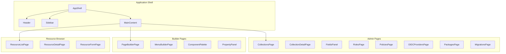
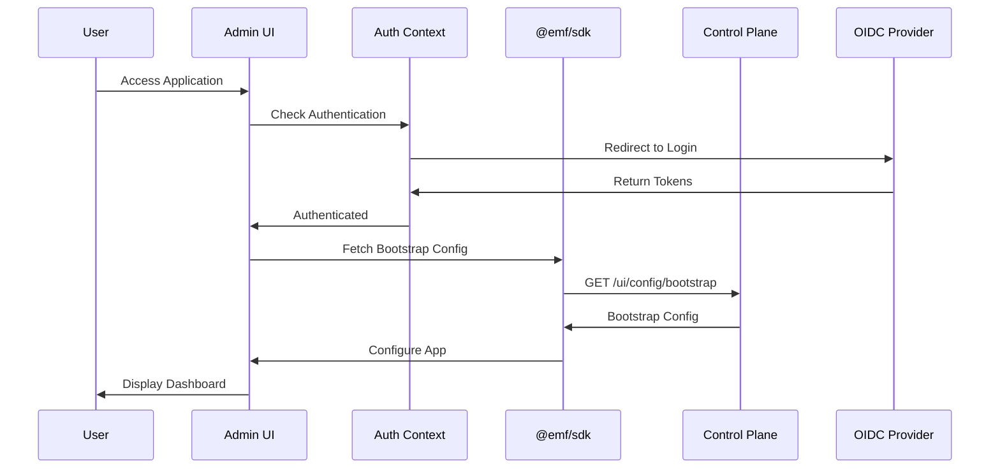

# Design Document: EMF Admin/Builder UI

## Overview

The EMF Admin/Builder UI is a React 18+ TypeScript application that provides a self-configuring administrative interface for the EMF platform. The application fetches its configuration from the control plane's bootstrap endpoint and dynamically configures routes, menus, themes, and branding based on the response.

### Key Design Principles

1. **Self-Configuration**: The UI configures itself from the control plane, requiring no environment-specific builds
2. **Component Reuse**: Leverages @emf/components for consistent UI patterns across the application
3. **SDK Integration**: Uses @emf/sdk for all API communication, ensuring type safety and consistent error handling
4. **Plugin Extensibility**: Supports custom field renderers and page components via @emf/plugin-sdk
5. **Accessibility First**: All components are built with WCAG 2.1 AA compliance from the start
6. **Responsive Design**: Mobile-first approach with progressive enhancement for larger screens

### Technology Stack

- **Framework**: React 18+ with TypeScript 5+
- **Routing**: React Router 6+
- **State Management**: TanStack Query for server state, React Context for UI state
- **Forms**: React Hook Form with Zod validation
- **Styling**: CSS Modules with CSS custom properties for theming
- **Testing**: Vitest + React Testing Library + fast-check for property-based testing
- **Build**: Vite
- **Linting**: ESLint + Prettier

## Architecture

### High-Level Architecture

```mermaid
graph TB
    subgraph "EMF Admin/Builder UI"
        App[App Component]
        Router[React Router]
        Auth[Auth Context]
        Config[Config Context]
        Theme[Theme Context]
        I18n[I18n Context]
        
        App --> Router
        App --> Auth
        App --> Config
        App --> Theme
        App --> I18n
        
        Router --> Pages[Page Components]
        Pages --> Components[UI Components]
        Components --> SDK[@emf/sdk]
        Components --> EMFComponents[@emf/components]
    end
    
    SDK --> CP[Control Plane API]
    SDK --> Runtime[Runtime API]
    Auth --> OIDC[OIDC Provider]
```

### Component Architecture



### Data Flow Architecture



## Components and Interfaces

### 1. Application Entry Point

#### App.tsx
The root component that initializes all providers and routing.

```typescript
interface AppProps {
  plugins?: Plugin[];
}

function App({ plugins = [] }: AppProps): JSX.Element {
  return (
    <ErrorBoundary fallback={<ErrorPage />}>
      <QueryClientProvider client={queryClient}>
        <AuthProvider>
          <ConfigProvider>
            <ThemeProvider>
              <I18nProvider>
                <PluginProvider plugins={plugins}>
                  <RouterProvider router={router} />
                </PluginProvider>
              </I18nProvider>
            </ThemeProvider>
          </ConfigProvider>
        </AuthProvider>
      </QueryClientProvider>
    </ErrorBoundary>
  );
}
```

### 2. Context Providers

#### AuthContext
Manages authentication state and OIDC flow.

```typescript
interface AuthContextValue {
  user: User | null;
  isAuthenticated: boolean;
  isLoading: boolean;
  login: (providerId?: string) => Promise<void>;
  logout: () => Promise<void>;
  getAccessToken: () => Promise<string>;
}

interface AuthProviderProps {
  children: React.ReactNode;
}

function AuthProvider({ children }: AuthProviderProps): JSX.Element;
function useAuth(): AuthContextValue;
```

#### ConfigContext
Manages bootstrap configuration and dynamic app settings.

```typescript
interface BootstrapConfig {
  pages: PageConfig[];
  menus: MenuConfig[];
  theme: ThemeConfig;
  branding: BrandingConfig;
  features: FeatureFlags;
}

interface ConfigContextValue {
  config: BootstrapConfig | null;
  isLoading: boolean;
  error: Error | null;
  reload: () => Promise<void>;
}

function ConfigProvider({ children }: { children: React.ReactNode }): JSX.Element;
function useConfig(): ConfigContextValue;
```

#### ThemeContext
Manages theme state and CSS custom properties.

```typescript
type ThemeMode = 'light' | 'dark' | 'system';

interface ThemeContextValue {
  mode: ThemeMode;
  resolvedMode: 'light' | 'dark';
  setMode: (mode: ThemeMode) => void;
  colors: ThemeColors;
}

function ThemeProvider({ children }: { children: React.ReactNode }): JSX.Element;
function useTheme(): ThemeContextValue;
```

#### I18nContext
Manages internationalization and locale settings.

```typescript
interface I18nContextValue {
  locale: string;
  setLocale: (locale: string) => void;
  t: (key: string, params?: Record<string, string>) => string;
  formatDate: (date: Date, options?: Intl.DateTimeFormatOptions) => string;
  formatNumber: (num: number, options?: Intl.NumberFormatOptions) => string;
  direction: 'ltr' | 'rtl';
}

function I18nProvider({ children }: { children: React.ReactNode }): JSX.Element;
function useI18n(): I18nContextValue;
```

### 3. Application Shell Components

#### AppShell
The main layout wrapper providing consistent structure.

```typescript
interface AppShellProps {
  children: React.ReactNode;
}

function AppShell({ children }: AppShellProps): JSX.Element;
```

#### Header
Top navigation bar with branding, user menu, and global actions.

```typescript
interface HeaderProps {
  branding: BrandingConfig;
  user: User | null;
  onLogout: () => void;
}

function Header({ branding, user, onLogout }: HeaderProps): JSX.Element;
```

#### Sidebar
Navigation sidebar with dynamic menu rendering.

```typescript
interface SidebarProps {
  menus: MenuConfig[];
  collapsed: boolean;
  onToggle: () => void;
}

function Sidebar({ menus, collapsed, onToggle }: SidebarProps): JSX.Element;
```

### 4. Admin Page Components

#### CollectionsPage
Lists and manages collections.

```typescript
function CollectionsPage(): JSX.Element;
```

Features:
- Paginated collection list using DataTable
- Filter by name and status
- Sort by name, created date, modified date
- Create, edit, delete actions
- Navigation to collection detail

#### CollectionDetailPage
Displays and edits a single collection.

```typescript
interface CollectionDetailPageProps {
  collectionId: string;
}

function CollectionDetailPage({ collectionId }: CollectionDetailPageProps): JSX.Element;
```

Features:
- Collection metadata display and editing
- Fields list with add, edit, delete, reorder
- Authorization configuration panel
- Version history panel

#### FieldEditor
Form for creating and editing fields.

```typescript
interface FieldEditorProps {
  collectionId: string;
  field?: FieldDefinition;
  onSave: (field: FieldDefinition) => void;
  onCancel: () => void;
}

function FieldEditor({ collectionId, field, onSave, onCancel }: FieldEditorProps): JSX.Element;
```

#### RolesPage
Lists and manages authorization roles.

```typescript
function RolesPage(): JSX.Element;
```

#### PoliciesPage
Lists and manages authorization policies.

```typescript
function PoliciesPage(): JSX.Element;
```

#### OIDCProvidersPage
Lists and manages OIDC providers.

```typescript
function OIDCProvidersPage(): JSX.Element;
```

Features:
- Provider list with status indicators
- Add, edit, delete providers
- Test connection functionality
- Provider configuration form

#### PackagesPage
Manages configuration package export and import.

```typescript
function PackagesPage(): JSX.Element;
```

Features:
- Export wizard with item selection
- Import with file upload and preview
- Dry-run validation
- Package history

#### MigrationsPage
Manages schema migrations.

```typescript
function MigrationsPage(): JSX.Element;
```

Features:
- Migration history list
- Plan migration wizard
- Execute with progress tracking
- Rollback options

### 5. Builder Page Components

#### PageBuilderPage
Visual page editor.

```typescript
interface PageBuilderPageProps {
  pageId?: string;
}

function PageBuilderPage({ pageId }: PageBuilderPageProps): JSX.Element;
```

Features:
- Component palette with drag-and-drop
- Canvas for page layout
- Property panel for component configuration
- Preview mode
- Save and publish actions

#### MenuBuilderPage
Menu configuration editor.

```typescript
interface MenuBuilderPageProps {
  menuId: string;
}

function MenuBuilderPage({ menuId }: MenuBuilderPageProps): JSX.Element;
```

Features:
- Tree view of menu items
- Drag-and-drop reordering
- Add, edit, delete menu items
- Nested item support
- Preview panel

#### ComponentPalette
Displays available components for page building.

```typescript
interface ComponentPaletteProps {
  onDragStart: (componentType: string) => void;
}

function ComponentPalette({ onDragStart }: ComponentPaletteProps): JSX.Element;
```

#### PropertyPanel
Displays and edits properties of selected component.

```typescript
interface PropertyPanelProps {
  component: PageComponent | null;
  onChange: (updates: Partial<PageComponent>) => void;
}

function PropertyPanel({ component, onChange }: PropertyPanelProps): JSX.Element;
```

### 6. Resource Browser Components

#### ResourceBrowserPage
Collection selector and data browser.

```typescript
function ResourceBrowserPage(): JSX.Element;
```

#### ResourceListPage
Displays records in a collection.

```typescript
interface ResourceListPageProps {
  collectionName: string;
}

function ResourceListPage({ collectionName }: ResourceListPageProps): JSX.Element;
```

Features:
- DataTable with pagination
- FilterBuilder integration
- Column selection
- Bulk actions
- Export to CSV/JSON

#### ResourceDetailPage
Displays a single record.

```typescript
interface ResourceDetailPageProps {
  collectionName: string;
  recordId: string;
}

function ResourceDetailPage({ collectionName, recordId }: ResourceDetailPageProps): JSX.Element;
```

#### ResourceFormPage
Create or edit a record.

```typescript
interface ResourceFormPageProps {
  collectionName: string;
  recordId?: string;
}

function ResourceFormPage({ collectionName, recordId }: ResourceFormPageProps): JSX.Element;
```

### 7. Dashboard Components

#### DashboardPage
System health and metrics overview.

```typescript
function DashboardPage(): JSX.Element;
```

Features:
- Health status cards
- Metrics charts
- Recent errors list
- Time range selector
- Auto-refresh

#### HealthCard
Displays health status for a service.

```typescript
interface HealthCardProps {
  service: string;
  status: 'healthy' | 'unhealthy' | 'unknown';
  details?: string;
}

function HealthCard({ service, status, details }: HealthCardProps): JSX.Element;
```

#### MetricsChart
Displays time-series metrics.

```typescript
interface MetricsChartProps {
  title: string;
  data: MetricDataPoint[];
  timeRange: TimeRange;
}

function MetricsChart({ title, data, timeRange }: MetricsChartProps): JSX.Element;
```

### 8. Plugin System

#### PluginProvider
Initializes and manages plugins.

```typescript
interface PluginProviderProps {
  plugins: Plugin[];
  children: React.ReactNode;
}

function PluginProvider({ plugins, children }: PluginProviderProps): JSX.Element;
```

#### usePlugins Hook
Access plugin registry and capabilities.

```typescript
interface PluginRegistry {
  fieldRenderers: Map<string, FieldRendererComponent>;
  pageComponents: Map<string, React.ComponentType>;
  registerFieldRenderer: (type: string, renderer: FieldRendererComponent) => void;
  registerPageComponent: (name: string, component: React.ComponentType) => void;
}

function usePlugins(): PluginRegistry;
```

### 9. Shared Components

#### ConfirmDialog
Reusable confirmation dialog.

```typescript
interface ConfirmDialogProps {
  open: boolean;
  title: string;
  message: string;
  confirmLabel?: string;
  cancelLabel?: string;
  onConfirm: () => void;
  onCancel: () => void;
  variant?: 'default' | 'danger';
}

function ConfirmDialog(props: ConfirmDialogProps): JSX.Element;
```

#### Toast
Notification toast component.

```typescript
interface ToastProps {
  message: string;
  type: 'success' | 'error' | 'warning' | 'info';
  duration?: number;
  onClose: () => void;
}

function Toast(props: ToastProps): JSX.Element;
```

#### LoadingSpinner
Loading indicator.

```typescript
interface LoadingSpinnerProps {
  size?: 'small' | 'medium' | 'large';
  label?: string;
}

function LoadingSpinner({ size, label }: LoadingSpinnerProps): JSX.Element;
```

#### ErrorMessage
Error display component.

```typescript
interface ErrorMessageProps {
  error: Error | string;
  onRetry?: () => void;
}

function ErrorMessage({ error, onRetry }: ErrorMessageProps): JSX.Element;
```

## Data Models

### Configuration Models

```typescript
interface BootstrapConfig {
  pages: PageConfig[];
  menus: MenuConfig[];
  theme: ThemeConfig;
  branding: BrandingConfig;
  features: FeatureFlags;
  oidcProviders: OIDCProviderSummary[];
}

interface PageConfig {
  id: string;
  path: string;
  title: string;
  component: string;
  props?: Record<string, unknown>;
  policies?: string[];
}

interface MenuConfig {
  id: string;
  name: string;
  items: MenuItemConfig[];
}

interface MenuItemConfig {
  id: string;
  label: string;
  path?: string;
  icon?: string;
  children?: MenuItemConfig[];
  policies?: string[];
}

interface ThemeConfig {
  primaryColor: string;
  secondaryColor: string;
  fontFamily: string;
  borderRadius: string;
}

interface BrandingConfig {
  logoUrl: string;
  applicationName: string;
  faviconUrl: string;
}

interface FeatureFlags {
  enableBuilder: boolean;
  enableResourceBrowser: boolean;
  enablePackages: boolean;
  enableMigrations: boolean;
  enableDashboard: boolean;
}

interface OIDCProviderSummary {
  id: string;
  name: string;
  issuer: string;
}
```

### Collection Models

```typescript
interface Collection {
  id: string;
  name: string;
  displayName: string;
  description?: string;
  storageMode: 'PHYSICAL_TABLE' | 'JSONB';
  active: boolean;
  currentVersion: number;
  fields: FieldDefinition[];
  authz?: CollectionAuthz;
  createdAt: string;
  updatedAt: string;
}

interface FieldDefinition {
  id: string;
  name: string;
  displayName?: string;
  type: FieldType;
  required: boolean;
  unique: boolean;
  indexed: boolean;
  defaultValue?: unknown;
  validation?: ValidationRule[];
  referenceTarget?: string;
  order: number;
}

type FieldType = 'string' | 'number' | 'boolean' | 'date' | 'datetime' | 'json' | 'reference';

interface ValidationRule {
  type: 'min' | 'max' | 'pattern' | 'email' | 'url' | 'custom';
  value?: unknown;
  message?: string;
}

interface CollectionAuthz {
  routePolicies: RoutePolicyConfig[];
  fieldPolicies: FieldPolicyConfig[];
}

interface RoutePolicyConfig {
  operation: 'read' | 'create' | 'update' | 'delete';
  policyId: string;
}

interface FieldPolicyConfig {
  fieldName: string;
  operation: 'read' | 'write';
  policyId: string;
}

interface CollectionVersion {
  id: string;
  version: number;
  schema: string;
  createdAt: string;
}
```

### Authorization Models

```typescript
interface Role {
  id: string;
  name: string;
  description?: string;
  createdAt: string;
}

interface Policy {
  id: string;
  name: string;
  description?: string;
  rules: PolicyRule[];
  createdAt: string;
}

interface PolicyRule {
  effect: 'allow' | 'deny';
  roles: string[];
  conditions?: PolicyCondition[];
}

interface PolicyCondition {
  field: string;
  operator: 'eq' | 'ne' | 'in' | 'contains';
  value: unknown;
}
```

### OIDC Models

```typescript
interface OIDCProvider {
  id: string;
  name: string;
  issuer: string;
  clientId: string;
  scopes: string[];
  active: boolean;
  createdAt: string;
  updatedAt: string;
}

interface OIDCProviderFormData {
  name: string;
  issuer: string;
  clientId: string;
  clientSecret?: string;
  scopes: string[];
}
```

### Package Models

```typescript
interface Package {
  id: string;
  name: string;
  version: string;
  items: PackageItem[];
  createdAt: string;
}

interface PackageItem {
  type: 'collection' | 'role' | 'policy' | 'page' | 'menu';
  id: string;
  content: unknown;
}

interface ExportOptions {
  collections?: string[];
  roles?: string[];
  policies?: string[];
  pages?: string[];
  menus?: string[];
}

interface ImportPreview {
  creates: PackageItem[];
  updates: PackageItem[];
  conflicts: ImportConflict[];
}

interface ImportConflict {
  item: PackageItem;
  existingItem: PackageItem;
  resolution?: 'skip' | 'overwrite';
}

interface ImportResult {
  success: boolean;
  created: number;
  updated: number;
  skipped: number;
  errors: ImportError[];
}

interface ImportError {
  item: PackageItem;
  message: string;
}
```

### Migration Models

```typescript
interface MigrationPlan {
  id: string;
  collectionId: string;
  fromVersion: number;
  toVersion: number;
  steps: MigrationStep[];
  estimatedDuration: number;
  risks: MigrationRisk[];
}

interface MigrationStep {
  order: number;
  operation: 'ADD_FIELD' | 'REMOVE_FIELD' | 'MODIFY_FIELD' | 'ADD_INDEX' | 'REMOVE_INDEX';
  details: Record<string, unknown>;
  reversible: boolean;
}

interface MigrationRisk {
  level: 'low' | 'medium' | 'high';
  description: string;
}

interface MigrationRun {
  id: string;
  planId: string;
  status: 'pending' | 'running' | 'completed' | 'failed' | 'rolled_back';
  steps: MigrationStepResult[];
  startedAt?: string;
  completedAt?: string;
  error?: string;
}

interface MigrationStepResult {
  stepOrder: number;
  status: 'pending' | 'running' | 'completed' | 'failed';
  startedAt?: string;
  completedAt?: string;
  error?: string;
}
```

### UI Builder Models

```typescript
interface UIPage {
  id: string;
  name: string;
  path: string;
  title: string;
  layout: PageLayout;
  components: PageComponent[];
  policies?: string[];
  published: boolean;
  createdAt: string;
  updatedAt: string;
}

interface PageLayout {
  type: 'single' | 'sidebar' | 'grid';
  config?: Record<string, unknown>;
}

interface PageComponent {
  id: string;
  type: string;
  props: Record<string, unknown>;
  children?: PageComponent[];
  position: ComponentPosition;
}

interface ComponentPosition {
  row: number;
  column: number;
  width: number;
  height: number;
}

interface UIMenu {
  id: string;
  name: string;
  items: UIMenuItem[];
  createdAt: string;
  updatedAt: string;
}

interface UIMenuItem {
  id: string;
  label: string;
  path?: string;
  icon?: string;
  order: number;
  children?: UIMenuItem[];
  policies?: string[];
}
```

### Dashboard Models

```typescript
interface HealthStatus {
  service: string;
  status: 'healthy' | 'unhealthy' | 'unknown';
  details?: string;
  lastChecked: string;
}

interface MetricDataPoint {
  timestamp: string;
  value: number;
}

interface TimeRange {
  start: Date;
  end: Date;
  granularity: 'minute' | 'hour' | 'day';
}

interface SystemMetrics {
  requestRate: MetricDataPoint[];
  errorRate: MetricDataPoint[];
  latencyP50: MetricDataPoint[];
  latencyP99: MetricDataPoint[];
}

interface RecentError {
  id: string;
  timestamp: string;
  level: 'error' | 'warning';
  message: string;
  source: string;
  traceId?: string;
}
```


## Correctness Properties

A property is a characteristic or behavior that should hold true across all valid executions of a system—essentially, a formal statement about what the system should do. Properties serve as the bridge between human-readable specifications and machine-verifiable correctness guarantees.

### Bootstrap and Configuration Properties

**Property 1: Bootstrap configuration applies routes**
*For any* valid bootstrap configuration containing page definitions, the application router should contain routes matching each page's path and component.
**Validates: Requirements 1.2**

**Property 2: Bootstrap configuration applies menus**
*For any* valid bootstrap configuration containing menu definitions, the navigation component should render menu items matching the configuration.
**Validates: Requirements 1.3**

**Property 3: Bootstrap configuration applies theme**
*For any* valid bootstrap configuration containing theme settings, the CSS custom properties should reflect the configured colors, fonts, and spacing values.
**Validates: Requirements 1.4**

**Property 4: Bootstrap configuration applies branding**
*For any* valid bootstrap configuration containing branding settings, the header should display the configured logo, application name, and the document should have the configured favicon.
**Validates: Requirements 1.5**

### Authentication Properties

**Property 5: API requests include authentication**
*For any* API request made to the control plane while authenticated, the request should include an Authorization header with a valid Bearer token.
**Validates: Requirements 2.7**

**Property 6: 401 responses trigger token refresh**
*For any* API request that returns a 401 Unauthorized response, the application should attempt to refresh the access token before retrying the request.
**Validates: Requirements 2.8**

### Collection Management Properties

**Property 7: Collection list displays all collections**
*For any* set of collections returned by the API, the collections page should display all collections with their name, status, and metadata.
**Validates: Requirements 3.1**

**Property 8: Collection filtering returns matching results**
*For any* filter criteria applied to the collections list, only collections matching the filter should be displayed.
**Validates: Requirements 3.2**

**Property 9: Collection sorting orders results correctly**
*For any* sort criteria applied to the collections list, collections should be displayed in the correct order according to the sort field and direction.
**Validates: Requirements 3.3**

**Property 10: Collection detail displays metadata and fields**
*For any* collection, the detail page should display all collection metadata and all active fields.
**Validates: Requirements 3.8**

**Property 11: Collection version history displays all versions**
*For any* collection with version history, the version history panel should display all versions with their version number and creation date.
**Validates: Requirements 3.12**

### Field Management Properties

**Property 12: Field list displays active fields**
*For any* collection, the fields panel should display all active fields in their configured order.
**Validates: Requirements 4.1**

**Property 13: All field types are supported**
*For any* field type (string, number, boolean, date, datetime, json, reference), the field editor should provide appropriate input controls and validation.
**Validates: Requirements 4.3**

**Property 14: Field reordering updates order**
*For any* drag-and-drop reorder operation on fields, the field order should be updated to reflect the new positions.
**Validates: Requirements 4.10**

**Property 15: Field validation rules are configurable**
*For any* validation rule type (required, min, max, pattern, email, url), the field editor should allow configuring the rule with appropriate inputs.
**Validates: Requirements 4.11**

### Form Properties (Consolidated)

**Property 16: Form submission calls API with valid data**
*For any* valid form submission (collection, field, role, policy, OIDC provider), the application should call the appropriate API endpoint with the form data and display a success message on completion.
**Validates: Requirements 3.5, 4.5, 5.3, 5.8, 6.4**

**Property 17: Form validation errors display inline**
*For any* form submission with validation errors, the errors should be displayed inline with the relevant form fields.
**Validates: Requirements 3.6, 4.6, 6.5, 18.2**

**Property 18: Edit forms pre-populate with current values**
*For any* edit operation on an existing entity (collection, field, role, policy, OIDC provider, record), the form should be pre-populated with the entity's current values.
**Validates: Requirements 3.9, 4.7, 5.4, 6.6, 11.9**

### Authorization Management Properties

**Property 19: Roles list displays all roles**
*For any* set of roles returned by the API, the roles page should display all roles with their name and description.
**Validates: Requirements 5.1**

**Property 20: Policies list displays all policies**
*For any* set of policies returned by the API, the policies page should display all policies with their name and description.
**Validates: Requirements 5.6**

**Property 21: Route authorization is configurable per operation**
*For any* collection, the authorization panel should allow selecting policies for each operation (read, create, update, delete).
**Validates: Requirements 5.9, 5.10**

**Property 22: Field authorization is configurable per field**
*For any* collection with fields, the authorization panel should allow selecting policies for each field and operation.
**Validates: Requirements 5.11, 5.12**

### OIDC Provider Properties

**Property 23: OIDC providers list displays all providers**
*For any* set of OIDC providers returned by the API, the providers page should display all providers with their name, issuer, and status.
**Validates: Requirements 6.1, 6.9**

**Property 24: OIDC provider form requires essential fields**
*For any* OIDC provider form submission, the form should require issuer URL, client ID, and scopes before allowing submission.
**Validates: Requirements 6.3**

### UI Builder Properties

**Property 25: Pages list displays all pages**
*For any* set of UI pages returned by the API, the pages builder should display all pages with their name, path, and published status.
**Validates: Requirements 7.1**

**Property 26: Page configuration supports required fields**
*For any* page being edited, the editor should allow configuring path, title, and access policies.
**Validates: Requirements 7.3**

**Property 27: Component addition from palette**
*For any* component type in the palette, dragging it to the canvas should add a new component instance to the page.
**Validates: Requirements 7.4**

**Property 28: Component properties are editable**
*For any* selected component on the canvas, the property panel should display and allow editing all component properties.
**Validates: Requirements 7.5**

**Property 29: Page save persists configuration**
*For any* page with unsaved changes, clicking save should persist the configuration via the API and update the saved state.
**Validates: Requirements 7.8**

**Property 30: Page duplication creates copy**
*For any* existing page, duplicating it should create a new page with the same configuration but a different ID.
**Validates: Requirements 7.10**

### Menu Builder Properties

**Property 31: Menus list displays all menus**
*For any* set of UI menus returned by the API, the menu builder should display all menus with their name and item count.
**Validates: Requirements 8.1**

**Property 32: Menu items support CRUD operations**
*For any* menu, the editor should allow adding, editing, and removing menu items.
**Validates: Requirements 8.3**

**Property 33: Menu item reordering updates order**
*For any* drag-and-drop reorder operation on menu items, the item order should be updated to reflect the new positions.
**Validates: Requirements 8.4**

**Property 34: Nested menu items are supported**
*For any* menu item, it should be possible to add child items to create hierarchical navigation.
**Validates: Requirements 8.5**

**Property 35: Menu item configuration supports all fields**
*For any* menu item being edited, the editor should allow configuring label, path, icon, and access policies.
**Validates: Requirements 8.6**

**Property 36: Menu save persists configuration**
*For any* menu with unsaved changes, clicking save should persist the configuration via the API.
**Validates: Requirements 8.7**

**Property 37: Menu preview reflects current state**
*For any* menu being edited, the preview should display the current menu structure including unsaved changes.
**Validates: Requirements 8.8**

### Package Management Properties

**Property 38: Export supports all item types**
*For any* export operation, the form should allow selecting collections, authorization config, UI pages, and menus.
**Validates: Requirements 9.3**

**Property 39: Import preview shows changes**
*For any* uploaded package file, the preview should display all items that will be created, updated, or conflict.
**Validates: Requirements 9.6**

**Property 40: Package history displays all operations**
*For any* set of package operations, the history should display all exports and imports with their timestamp and status.
**Validates: Requirements 9.10**

### Migration Management Properties

**Property 41: Migration history displays all runs**
*For any* set of migration runs, the history should display all runs with their status, duration, and step count.
**Validates: Requirements 10.1**

**Property 42: Migration plan displays steps**
*For any* generated migration plan, the UI should display all steps with their operation type and details.
**Validates: Requirements 10.3**

**Property 43: Migration plan displays risks**
*For any* generated migration plan, the UI should display estimated impact and risk level for each step.
**Validates: Requirements 10.4**

**Property 44: Migration history shows step details**
*For any* completed migration run, the history detail should display status, duration, and details for each step.
**Validates: Requirements 10.8**

### Resource Browser Properties

**Property 45: Resource browser lists collections**
*For any* set of collections, the resource browser should display all collections available for browsing.
**Validates: Requirements 11.1**

**Property 46: Record list displays paginated data**
*For any* collection with records, selecting it should display a paginated data table of records.
**Validates: Requirements 11.2**

**Property 47: Record filtering returns matching results**
*For any* filter criteria applied using FilterBuilder, only records matching the filter should be displayed.
**Validates: Requirements 11.3**

**Property 48: Record sorting orders results correctly**
*For any* column header click, records should be sorted by that column in the appropriate direction.
**Validates: Requirements 11.4**

**Property 49: Column selection controls visibility**
*For any* column selection change, only selected columns should be visible in the data table.
**Validates: Requirements 11.5**

**Property 50: Record form generated from schema**
*For any* collection, the create record form should contain inputs for all fields defined in the collection schema.
**Validates: Requirements 11.6**

**Property 51: Record detail displays all fields**
*For any* record, the detail view should display all field values with appropriate formatting for each field type.
**Validates: Requirements 11.8**

**Property 52: Bulk selection enables bulk operations**
*For any* set of selected records, bulk operations (delete, export) should be available and operate on all selected records.
**Validates: Requirements 11.11**

**Property 53: Export generates valid format**
*For any* export operation (CSV or JSON), the exported file should contain all selected records in the correct format.
**Validates: Requirements 11.12**

### Plugin System Properties

**Property 54: Plugins load on startup**
*For any* configured plugin, the application should load and initialize it during startup.
**Validates: Requirements 12.1**

**Property 55: Custom field renderers are registered**
*For any* plugin that registers a field renderer, the renderer should be available in the ComponentRegistry.
**Validates: Requirements 12.2**

**Property 56: Custom page components are registered**
*For any* plugin that registers a page component, the component should be available in the ComponentRegistry.
**Validates: Requirements 12.3**

**Property 57: Custom field renderers are used**
*For any* field with a custom type that has a registered renderer, the custom renderer should be used instead of the default.
**Validates: Requirements 12.4**

**Property 58: Custom page components are used**
*For any* page containing a custom component type that has a registered component, the custom component should be rendered.
**Validates: Requirements 12.5**

**Property 59: Plugin failures don't block loading**
*For any* plugin that fails to load, the error should be logged and other plugins should continue loading.
**Validates: Requirements 12.7**

**Property 60: Plugin lifecycle hooks are called**
*For any* plugin with lifecycle hooks, the hooks should be called at the appropriate times (init, cleanup).
**Validates: Requirements 12.8**

### Dashboard Properties

**Property 61: Health status displays all services**
*For any* set of health check results, the dashboard should display status for control plane, database, Kafka, and Redis.
**Validates: Requirements 13.2**

**Property 62: Metrics display key indicators**
*For any* set of metrics data, the dashboard should display request rate, error rate, and latency metrics.
**Validates: Requirements 13.3**

**Property 63: Recent errors are displayed**
*For any* set of recent errors, the dashboard should display them with timestamp, level, and message.
**Validates: Requirements 13.4**

**Property 64: Time range controls metrics display**
*For any* time range selection, the metrics should be filtered to show only data within that range.
**Validates: Requirements 13.5**

**Property 65: Auto-refresh updates metrics**
*For any* configured refresh interval, the metrics should be automatically refreshed at that interval.
**Validates: Requirements 13.6**

### Accessibility Properties

**Property 66: Keyboard navigation works for all elements**
*For any* interactive element, it should be focusable and operable using keyboard only.
**Validates: Requirements 14.2**

**Property 67: ARIA attributes are present**
*For any* component, appropriate ARIA labels and roles should be present for screen reader compatibility.
**Validates: Requirements 14.3**

**Property 68: Color contrast meets requirements**
*For any* text element, the color contrast ratio should meet WCAG 2.1 AA requirements (4.5:1 for normal text, 3:1 for large text).
**Validates: Requirements 14.4**

**Property 69: Dynamic content announces changes**
*For any* dynamic content change, appropriate ARIA live regions should announce the change to screen readers.
**Validates: Requirements 14.5**

**Property 70: Focus indicators are visible**
*For any* focusable element, a visible focus indicator should be displayed when the element has focus.
**Validates: Requirements 14.6**

**Property 71: Reduced motion is respected**
*For any* animation, it should be disabled or reduced when the user has enabled reduced motion preferences.
**Validates: Requirements 14.7**

**Property 72: Non-text content has alternatives**
*For any* image, icon, or other non-text content, appropriate alt text or aria-label should be provided.
**Validates: Requirements 14.8**

### Internationalization Properties

**Property 73: Multiple languages are supported**
*For any* supported language, all UI text should have translations available.
**Validates: Requirements 15.1**

**Property 74: Language preference persists**
*For any* language selection, the preference should be persisted and restored on subsequent visits.
**Validates: Requirements 15.4**

**Property 75: Language changes without reload**
*For any* language change, all UI text should update immediately without requiring a page reload.
**Validates: Requirements 15.5**

**Property 76: RTL languages are supported**
*For any* RTL language selection, the text direction should change to right-to-left.
**Validates: Requirements 15.6**

**Property 77: Locale formatting is applied**
*For any* date, number, or currency display, the formatting should match the selected locale.
**Validates: Requirements 15.7**

### Theme Properties

**Property 78: Light and dark themes are available**
*For any* theme selection (light or dark), the UI should apply the appropriate color scheme.
**Validates: Requirements 16.1**

**Property 79: Theme preference persists**
*For any* theme selection, the preference should be persisted and restored on subsequent visits.
**Validates: Requirements 16.4**

**Property 80: Theme changes without reload**
*For any* theme change, all UI colors should update immediately without requiring a page reload.
**Validates: Requirements 16.5**

**Property 81: Bootstrap theme is applied**
*For any* bootstrap configuration with theme colors, those colors should be applied to the UI.
**Validates: Requirements 16.6**

**Property 82: Both themes meet contrast requirements**
*For any* theme (light or dark), all text should meet WCAG 2.1 AA contrast requirements.
**Validates: Requirements 16.7**

### Responsive Design Properties

**Property 83: Desktop layout is applied**
*For any* viewport width of 1024px or above, the desktop layout should be applied.
**Validates: Requirements 17.1**

**Property 84: Tablet layout is applied**
*For any* viewport width between 768px and 1023px, the tablet layout should be applied.
**Validates: Requirements 17.2**

**Property 85: Mobile layout is applied**
*For any* viewport width below 768px, the mobile layout should be applied.
**Validates: Requirements 17.3**

**Property 86: Mobile navigation collapses**
*For any* mobile viewport, the navigation menu should collapse into a hamburger menu.
**Validates: Requirements 17.4**

**Property 87: Mobile forms stack vertically**
*For any* mobile viewport, form fields should stack vertically.
**Validates: Requirements 17.5**

### Error Handling Properties

**Property 88: API errors display messages**
*For any* failed API request, an appropriate error message should be displayed to the user.
**Validates: Requirements 18.1**

**Property 89: Success messages are displayed**
*For any* successful operation, a success message should be displayed to the user.
**Validates: Requirements 18.3**

**Property 90: Loading indicators are shown**
*For any* async operation in progress, a loading indicator should be displayed.
**Validates: Requirements 18.4**

**Property 91: Network errors offer retry**
*For any* network error, a retry option should be offered to the user.
**Validates: Requirements 18.5**

**Property 92: Errors are logged with detail**
*For any* error, it should be logged to the console with sufficient detail for debugging.
**Validates: Requirements 18.6**

**Property 93: Error boundary catches errors**
*For any* unexpected error in a component, the error boundary should catch it and display a fallback UI.
**Validates: Requirements 18.7**

## Error Handling

### Error Categories

1. **Network Errors**: Connection failures, timeouts, DNS resolution failures
   - Display: Toast notification with retry option
   - Recovery: Automatic retry with exponential backoff (3 attempts)
   - Logging: Log to console with request details

2. **Authentication Errors**: Token expiration, invalid tokens, unauthorized access
   - Display: Redirect to login or show session expired modal
   - Recovery: Attempt token refresh, then redirect to login
   - Logging: Log authentication state changes

3. **Validation Errors**: Form validation failures, API validation rejections
   - Display: Inline error messages next to relevant fields
   - Recovery: User corrects input and resubmits
   - Logging: Log validation failures for debugging

4. **API Errors**: Server errors (5xx), business logic errors (4xx)
   - Display: Toast notification with error message
   - Recovery: Retry option for transient errors
   - Logging: Log full error response with correlation ID

5. **Application Errors**: Unexpected JavaScript errors, component failures
   - Display: Error boundary fallback UI
   - Recovery: Offer page reload or navigation to home
   - Logging: Log error stack trace and component tree

### Error Handling Patterns

```typescript
// Global error handler for API requests
async function handleApiError(error: ApiError): Promise<void> {
  if (error.status === 401) {
    await attemptTokenRefresh();
  } else if (error.status >= 500) {
    showToast({ type: 'error', message: 'Server error. Please try again.' });
  } else if (error.status === 422) {
    // Validation errors handled by form
    throw error;
  } else {
    showToast({ type: 'error', message: error.message });
  }
  
  console.error('[API Error]', {
    status: error.status,
    message: error.message,
    correlationId: error.correlationId,
    timestamp: new Date().toISOString(),
  });
}

// Error boundary for component errors
class AppErrorBoundary extends React.Component {
  state = { hasError: false, error: null };
  
  static getDerivedStateFromError(error: Error) {
    return { hasError: true, error };
  }
  
  componentDidCatch(error: Error, errorInfo: React.ErrorInfo) {
    console.error('[Component Error]', {
      error: error.message,
      stack: error.stack,
      componentStack: errorInfo.componentStack,
    });
  }
  
  render() {
    if (this.state.hasError) {
      return <ErrorPage error={this.state.error} onRetry={() => window.location.reload()} />;
    }
    return this.props.children;
  }
}
```

### Retry Strategy

```typescript
interface RetryConfig {
  maxAttempts: number;
  baseDelay: number;
  maxDelay: number;
}

const defaultRetryConfig: RetryConfig = {
  maxAttempts: 3,
  baseDelay: 1000,
  maxDelay: 10000,
};

async function withRetry<T>(
  operation: () => Promise<T>,
  config: RetryConfig = defaultRetryConfig
): Promise<T> {
  let lastError: Error;
  
  for (let attempt = 1; attempt <= config.maxAttempts; attempt++) {
    try {
      return await operation();
    } catch (error) {
      lastError = error as Error;
      
      if (attempt < config.maxAttempts && isRetryable(error)) {
        const delay = Math.min(
          config.baseDelay * Math.pow(2, attempt - 1),
          config.maxDelay
        );
        await sleep(delay);
      }
    }
  }
  
  throw lastError;
}

function isRetryable(error: unknown): boolean {
  if (error instanceof ApiError) {
    return error.status >= 500 || error.status === 429;
  }
  return error instanceof NetworkError;
}
```

## Testing Strategy

### Testing Approach

The testing strategy employs a dual approach combining unit tests and property-based tests:

1. **Unit Tests**: Verify specific examples, edge cases, and integration points
2. **Property-Based Tests**: Verify universal properties across randomly generated inputs

### Testing Tools

- **Test Runner**: Vitest
- **Component Testing**: React Testing Library
- **Property-Based Testing**: fast-check
- **Mocking**: MSW (Mock Service Worker) for API mocking
- **Accessibility Testing**: jest-axe

### Property-Based Testing Configuration

Each property test must:
- Run minimum 100 iterations
- Reference the design document property number
- Use the tag format: **Feature: admin-builder-ui, Property {number}: {property_text}**

```typescript
import { fc } from 'fast-check';
import { describe, it, expect } from 'vitest';

// Example property test structure
describe('Collection Management', () => {
  // Feature: admin-builder-ui, Property 8: Collection filtering returns matching results
  it('should filter collections by name', () => {
    fc.assert(
      fc.property(
        fc.array(collectionArbitrary, { minLength: 0, maxLength: 50 }),
        fc.string({ minLength: 1, maxLength: 20 }),
        (collections, filterText) => {
          const filtered = filterCollections(collections, { name: filterText });
          return filtered.every(c => 
            c.name.toLowerCase().includes(filterText.toLowerCase())
          );
        }
      ),
      { numRuns: 100 }
    );
  });
});
```

### Test Categories

#### 1. Component Unit Tests
- Render tests for all components
- User interaction tests (clicks, inputs, keyboard)
- State management tests
- Error state rendering

#### 2. Hook Unit Tests
- Custom hook behavior tests
- State transitions
- Side effect verification

#### 3. Integration Tests
- Page-level tests with mocked API
- Navigation flow tests
- Form submission flows

#### 4. Property-Based Tests
- Data transformation properties
- Filter/sort correctness
- Form validation properties
- State invariants

#### 5. Accessibility Tests
- ARIA attribute verification
- Keyboard navigation
- Color contrast validation
- Screen reader compatibility

### Test File Organization

```
app/src/
├── components/
│   ├── Header/
│   │   ├── Header.tsx
│   │   ├── Header.test.tsx
│   │   └── Header.properties.test.tsx
│   └── ...
├── pages/
│   ├── CollectionsPage/
│   │   ├── CollectionsPage.tsx
│   │   ├── CollectionsPage.test.tsx
│   │   └── CollectionsPage.properties.test.tsx
│   └── ...
├── hooks/
│   ├── useAuth.ts
│   ├── useAuth.test.ts
│   └── ...
└── utils/
    ├── filters.ts
    ├── filters.test.ts
    └── filters.properties.test.ts
```

### Arbitraries for Property Testing

```typescript
// Collection arbitrary
const collectionArbitrary = fc.record({
  id: fc.uuid(),
  name: fc.string({ minLength: 1, maxLength: 50 }),
  displayName: fc.string({ minLength: 1, maxLength: 100 }),
  description: fc.option(fc.string({ maxLength: 500 })),
  storageMode: fc.constantFrom('PHYSICAL_TABLE', 'JSONB'),
  active: fc.boolean(),
  currentVersion: fc.integer({ min: 1, max: 100 }),
  fields: fc.array(fieldArbitrary, { maxLength: 20 }),
  createdAt: fc.date().map(d => d.toISOString()),
  updatedAt: fc.date().map(d => d.toISOString()),
});

// Field arbitrary
const fieldArbitrary = fc.record({
  id: fc.uuid(),
  name: fc.string({ minLength: 1, maxLength: 50 }),
  displayName: fc.option(fc.string({ maxLength: 100 })),
  type: fc.constantFrom('string', 'number', 'boolean', 'date', 'datetime', 'json', 'reference'),
  required: fc.boolean(),
  unique: fc.boolean(),
  indexed: fc.boolean(),
  order: fc.integer({ min: 0, max: 100 }),
});

// Menu item arbitrary (recursive for nested items)
const menuItemArbitrary: fc.Arbitrary<UIMenuItem> = fc.letrec(tie => ({
  menuItem: fc.record({
    id: fc.uuid(),
    label: fc.string({ minLength: 1, maxLength: 50 }),
    path: fc.option(fc.string({ minLength: 1, maxLength: 100 })),
    icon: fc.option(fc.string({ minLength: 1, maxLength: 30 })),
    order: fc.integer({ min: 0, max: 100 }),
    children: fc.option(fc.array(tie('menuItem'), { maxLength: 5 })),
  }),
})).menuItem;
```

### Coverage Requirements

- **Line Coverage**: Minimum 80%
- **Branch Coverage**: Minimum 75%
- **Function Coverage**: Minimum 85%
- **Property Test Coverage**: All 93 properties must have corresponding tests
